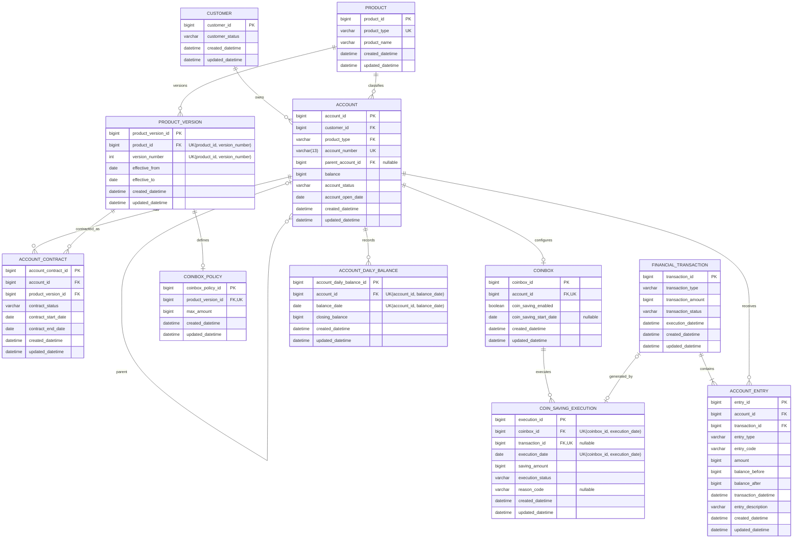

# 01. CoinBox ERD

이 문서는 CoinBox 데이터 모델의 ERD, 테이블별 컬럼 의미, Enum과 데이터 제약을 정의합니다.
프로세스 흐름은 [`02_SEQUENCE_DIAGRAM.md`](./02_SEQUENCE_DIAGRAM.md), 단계별 예시 데이터는
[`03_DATA_FLOW.md`](./03_DATA_FLOW.md)를 참고합니다.

## 1.0 ERD

ERD의 `FK`는 테이블 사이의 업무상 논리 참조를 뜻합니다. 현재 구현은 JPA 객체 연관관계를 사용하지 않고
모든 참조 값을 `Long` 또는 Enum 컬럼으로 직접 보관하므로 Hibernate가 물리 외래 키를 생성하지 않습니다.
PK·UK·nullable·길이는 Entity와 DB 제약으로 적용하고, 참조 무결성은 Service의 잠금 후 검증과 저장
순서로 보장합니다. 운영 환경에서는 마이그레이션 도구로 물리 FK와 금액·기간 CHECK 제약을 추가할 수 있습니다.

## 1.1 CUSTOMER

`CUSTOMER`는 계좌를 소유하는 개인 고객의 서비스 이용 상태를 관리합니다.

| 컬럼               | 타입 및 제약    | 의미                             |
| ------------------ | --------------- | -------------------------------- |
| `customer_id`      | `bigint`, PK    | Snowflake로 생성하는 고객 식별자 |
| `customer_status`  | `varchar`, Enum | 고객의 현재 서비스 이용 상태     |
| `created_datetime` | `datetime`      | 고객 데이터 생성 일시            |
| `updated_datetime` | `datetime`      | 고객 데이터 최종 수정 일시       |

### CustomerStatus

| Enum 값      | 한글 의미 | 설명                                                   |
| ------------ | --------- | ------------------------------------------------------ |
| `ACTIVE`     | 정상      | 정상적으로 서비스를 이용할 수 있는 고객                |
| `RESTRICTED` | 이용 제한 | 사고 신고나 운영 정책 등으로 서비스 이용이 제한된 고객 |
| `WITHDRAWN`  | 탈퇴      | 고객 탈퇴가 완료된 최종 상태                           |

현재 서비스 고객은 실명 개인으로 한정하므로 별도의 고객 유형 컬럼은 두지 않습니다. 개인사업자통장은
고객 유형이 아니라 계좌 상품의 성격이므로 `ProductType.BUSINESS_DEMAND_DEPOSIT`으로 구분합니다.

---

## 1.2 ACCOUNT

`ACCOUNT`는 고객의 계좌 정보, 현재 상품 유형과 현재 잔액을 관리합니다. 저금통도 별도의 계좌로 생성하며,
연결 입출금계좌는 저금통 계좌의 `parent_account_id`로 표현합니다.

| 컬럼                | 타입 및 제약           | 의미                                                                                               |
| ------------------- | ---------------------- | -------------------------------------------------------------------------------------------------- |
| `account_id`        | `bigint`, PK           | Snowflake로 생성하는 계좌 식별자                                                                   |
| `customer_id`       | `bigint`, FK           | 계좌를 소유한 고객 식별자                                                                          |
| `product_type`      | `varchar`, Enum, FK    | 계좌에 현재 적용된 상품 유형. `PRODUCT.product_type`을 참조합니다.                                   |
| `account_number`    | `varchar(13)`, UK      | 하이픈 없이 숫자로 구성된 13자리 문자열로 저장하는 중복 불가능한 계좌번호. 표시 형식은 화면에서 적용합니다. |
| `parent_account_id` | `bigint`, FK, nullable | 자식 계좌에 연결된 입출금계좌 식별자. 일반 입출금계좌는 `null`입니다.                                |
| `balance`           | `bigint`               | 원 단위의 현재 계좌 잔액. 거래 반영 후 최신 값을 관리합니다.                                         |
| `account_status`    | `varchar`, Enum        | 계좌의 현재 거래 가능 상태                                                                         |
| `account_open_date` | `date`                 | 계좌가 실제로 개설된 날짜. 생성 후 변경하지 않습니다.                                                |
| `created_datetime`  | `datetime`             | 계좌 생성 일시                                                                                     |
| `updated_datetime`  | `datetime`             | 계좌 데이터 최종 수정 일시                                                                         |

### AccountStatus

| Enum 값      | 한글 의미 | 설명                                                 |
| ------------ | --------- | ---------------------------------------------------- |
| `ACTIVE`     | 정상      | 입금과 출금 등 정상적인 계좌 거래가 가능한 상태      |
| `RESTRICTED` | 거래 제한 | 사고 신고나 운영 정책 등으로 계좌 거래가 제한된 상태 |
| `CLOSED`     | 해지      | 계좌 해지가 완료된 최종 상태                         |

계좌 잔액을 변경할 때는 동시 거래로 인한 잔액 유실을 방지하도록 계좌를 잠그고 처리합니다.
단, `/internal/v1/test-account-deposits`와 `/internal/v1/test-account-withdrawals`는 로컬 테스트 데이터를
준비하는 보조 API이므로 예외적으로 `DEMAND_DEPOSIT` 계좌의 `balance`만 직접 증가·감소시키며
금융거래·계좌 원장과 잠금을 생성하지 않습니다. 테스트 출금은 음수 잔고만 방지합니다. 이 동작은 실제
입출금 업무의 데이터 흐름이나 운영 설계를 의미하지 않습니다.
`ACCOUNT.account_number`는 선행 0을 보존할 수 있도록 숫자형이 아닌 `varchar`를 사용하며,
DB에는 하이픈 없이 저장합니다. 하이픈을 포함한 표시 형식은 Client 또는 응답 변환 계층에서 적용합니다.
앞 4자리는 계좌번호 상품 계열을 나타내며, 나머지 9자리는 과제 범위의 난수 기반 채번값입니다.

| 상품 유형 | 계좌번호 prefix | 예시 |
|---|---:|---|
| `DEMAND_DEPOSIT` | `3333` | `3333123456789` |
| `BUSINESS_DEMAND_DEPOSIT` | `3333` | `3333987654321` |
| `COINBOX` | `3310` | `3310000012345` |
| `MEETING_ACCOUNT` | `7979` | `7979000012345` |

개인사업자통장은 과제의 계좌번호 규칙에서 일반 입출금계좌와 같은 `3333` prefix를 사용하지만,
가입 자격은 계좌번호가 아니라 `product_type`으로 판단합니다.

채번 전에 같은 번호가 존재하는지 확인하고 충돌하면 새 번호를 생성합니다. 동시 요청 사이의 최종 중복은
`account_number` 유니크 제약으로 차단합니다. 실제 금융 시스템에서 사용하는 중앙 채번, 체크 디지트,
폐쇄 계좌번호 재사용 방지 정책은 과제 범위에서 제외합니다.
`ACCOUNT.product_type`은 일반 계좌 업무에서 사용하는 현재 운영 유형입니다. 가입·전환으로 현재 상품
유형을 변경해야 하는 경우 관련 계약 처리와 같은 트랜잭션에서 변경합니다. `CLOSED` 계좌는 고객의
사용 가능한 계좌 조회에서 제외합니다.

---

## 1.3 PRODUCT

`PRODUCT`는 은행이 제공하는 실제 상품군의 변경되지 않는 기준 정보를 관리합니다.
`DEMAND_DEPOSIT`, `COINBOX`처럼 서로 다른 계약과 정책을 가질 수 있는 단위를 하나의 상품군으로 봅니다.

| 컬럼               | 타입 및 제약        | 의미                                                              |
| ------------------ | ------------------- | ----------------------------------------------------------------- |
| `product_id`       | `bigint`, PK        | Snowflake로 생성하는 상품 식별자                                  |
| `product_name`     | `varchar`           | 고객과 운영자에게 표시하는 상품명                                 |
| `product_type`     | `varchar`, Enum, UK | 상품을 식별하는 중복 불가능한 업무 유형. 생성 후 변경하지 않습니다. |
| `created_datetime` | `datetime`          | 상품 데이터 생성 일시                                             |
| `updated_datetime` | `datetime`          | 상품 데이터 최종 수정 일시                                        |

### ProductType

| Enum 값              | 한글 의미  | 설명                                            |
| -------------------- | ---------- | ----------------------------------------------- |
| `DEMAND_DEPOSIT`     | 입출금통장 | 자유롭게 입금과 출금이 가능한 요구불예금 상품   |
| `BUSINESS_DEMAND_DEPOSIT` | 개인사업자통장 | 개인사업자의 사업용 입출금 거래를 위한 요구불예금 상품 |
| `COINBOX`            | 저금통     | 입출금계좌에 연결하여 잔돈을 모으는 저금통 상품 |
| `MEETING_ACCOUNT`    | 모임통장   | 모임 구성원이 함께 사용하는 모임통장 상품       |
| `INSTALLMENT_SAVING` | 적금       | 일정 기간 동안 금액을 납입하는 적립식 예금 상품 |
| `FIXED_DEPOSIT`      | 정기예금   | 일정 기간 자금을 예치하는 거치식 예금 상품      |

상품 유형당 하나의 `PRODUCT`만 생성할 수 있습니다. `product_code`와 `product_status`는 현재 과제 범위에서
관리하지 않습니다. 참조 중인 `PRODUCT`는 삭제하지 않으며 `product_type`은 변경하지 않습니다.
표시 목적의 `product_name`은 상품의 정체성을 바꾸지 않는 범위에서 수정할 수 있습니다.
저금통 가입의 근거계좌는 `DEMAND_DEPOSIT`만 허용하므로 `BUSINESS_DEMAND_DEPOSIT`과
`MEETING_ACCOUNT`는 ACTIVE 상태여도 가입 가능 목록에서 제외합니다.

---

## 1.4 PRODUCT_VERSION

`PRODUCT_VERSION`은 같은 상품군의 정책이 시간에 따라 변경되는 이력을 관리합니다.
가입 시 계약 시작일에 유효한 버전을 결정하고, 이후에는 날짜로 다시 찾지 않고 계약에 저장된
`product_version_id`를 사용합니다.

| 컬럼                 | 타입 및 제약          | 의미                                                                          |
| -------------------- | --------------------- | ----------------------------------------------------------------------------- |
| `product_version_id` | `bigint`, PK          | Snowflake로 생성하는 상품 버전 식별자                                         |
| `product_id`         | `bigint`, FK, 복합 UK | 버전이 속한 상품 식별자                                                       |
| `version_number`     | `int`, 복합 UK        | 같은 상품 안에서 증가하는 버전 번호                                           |
| `effective_from`     | `date`                | 해당 버전의 적용 시작일. 포함 조건입니다.                                       |
| `effective_to`       | `date`                | 해당 버전의 적용 종료일. 미포함 조건이며 현재 마지막 버전은 `9999-12-31`입니다. |
| `created_datetime`   | `datetime`            | 상품 버전 생성 일시                                                           |
| `updated_datetime`   | `datetime`            | 상품 버전 데이터 최종 수정 일시                                               |

`(product_id, version_number)` 복합 UK로 같은 상품의 버전 번호 중복을 방지합니다.
유효기간은 `[effective_from, effective_to)`로 해석하며 `effective_from < effective_to`여야 합니다.
현재 가장 최근 버전도 종료일을 `null`로 두지 않고 `9999-12-31`로 저장합니다. 같은 상품의 버전
유효기간은 겹칠 수 없습니다. 운영자용 버전 등록 기능을 구현할 때는 `PRODUCT`를 잠근 뒤 중복 기간을 검증합니다.
새 버전을 등록할 때 직전 최신 버전의 `effective_to`만 새 버전의 `effective_from`으로 변경할 수 있습니다.
계약은 `product_version_id`를 직접 참조하므로 이 종료일 변경이 기존 계약의 정책을 바꾸지는 않습니다.
그 외 버전 정보와 참조 중인 버전·정책은 수정하거나 삭제하지 않습니다.

---

## 1.5 ACCOUNT_CONTRACT

`ACCOUNT_CONTRACT`는 특정 계좌가 어떤 상품 버전으로 계약했는지와 계약 기간을 관리합니다.
상품 유형을 중복 저장하지 않고 `product_version_id`로 계약 당시 적용된 상품과 정책을 확정합니다.

| 컬럼                  | 타입 및 제약    | 의미                                                                         |
| --------------------- | --------------- | ---------------------------------------------------------------------------- |
| `account_contract_id` | `bigint`, PK    | Snowflake로 생성하는 계좌 상품계약 식별자                                    |
| `account_id`          | `bigint`, FK    | 계약으로 개설되거나 관리되는 계좌 식별자                                     |
| `product_version_id`  | `bigint`, FK    | 계약 체결 당시 확정된 상품 버전 식별자                                       |
| `contract_status`     | `varchar`, Enum | 고객과 상품 사이 계약의 현재 상태                                            |
| `contract_start_date` | `date`          | 계약 효력이 시작된 날짜                                                      |
| `contract_end_date`   | `date`          | 계약 종료일. 활성 계약은 `9999-12-31`, 종료된 계약은 실제 종료일을 저장합니다. |
| `created_datetime`    | `datetime`      | 계약 데이터 생성 일시                                                        |
| `updated_datetime`    | `datetime`      | 계약 데이터 최종 수정 일시                                                   |

### ContractStatus

| Enum 값      | 한글 의미 | 설명                                |
| ------------ | --------- | ----------------------------------- |
| `ACTIVE`     | 계약 중   | 효력이 유지되고 있는 계약           |
| `TERMINATED` | 계약 종료 | 고객 해지 등으로 효력이 종료된 계약 |

`ACTIVE` 계약의 `contract_end_date`는 `9999-12-31`이어야 하며,
`TERMINATED` 계약의 `contract_end_date`에는 실제 종료일을 저장합니다. 계약 기간은
`[contract_start_date, contract_end_date)`로 해석합니다. 활성 계약은 시작일이 미종료일보다 앞서야 하고,
종료 계약은 개설 당일 해지도 허용하므로 `contract_start_date <= contract_end_date`여야 합니다.
계좌에는 최대 하나의 `ACTIVE` 계약만 존재해야 합니다. 현재 과제에서는 Service가 계좌를 잠근 뒤 이 규칙을
검증하며, 운영 환경에서는 활성 계약을 위한 별도의 물리 제약도 고려합니다. 활성 계약을 생성하거나 종료할 때는 계좌를 잠그고,
필요한 `ACCOUNT.product_type` 변경까지 하나의 트랜잭션에서 처리합니다. 활성 계약의 상품 버전이 속한
`PRODUCT.product_type`은 해당 시점의 `ACCOUNT.product_type`과 일치해야 합니다.
`ACCOUNT.product_type`은 운영 조회를 위한 비정규화 값이고, 계약 상품 이력의 원본은
`ACCOUNT_CONTRACT.product_version_id`입니다.

---

## 1.6 COINBOX_POLICY

`COINBOX_POLICY`는 특정 저금통 상품 버전에 적용되는 저금통 전용 정책을 관리합니다.
상품 정책과 고객별 기능 설정을 분리하기 위해 최대 보유 한도를 `COINBOX`가 아니라 이 테이블에 저장합니다.

| 컬럼                 | 타입 및 제약     | 의미                                                                       |
| -------------------- | ---------------- | -------------------------------------------------------------------------- |
| `coinbox_policy_id`  | `bigint`, PK     | Snowflake로 생성하는 저금통 정책 식별자                                    |
| `product_version_id` | `bigint`, FK, UK | 정책이 속한 저금통 상품 버전 식별자. 버전과 정책의 1:0..1 관계를 보장합니다. |
| `max_amount`         | `bigint`         | 해당 상품 버전의 저금통이 보유할 수 있는 원 단위 최대 금액                 |
| `created_datetime`   | `datetime`       | 저금통 정책 생성 일시                                                      |
| `updated_datetime`   | `datetime`       | 저금통 정책 데이터 최종 수정 일시                                          |

`max_amount`는 0원보다 커야 합니다. `PRODUCT.product_type = COINBOX`인 상품 버전에만 정책을 생성할 수 있습니다.
`COINBOX_POLICY`는 별도의 적용 시작일과 종료일을 중복 저장하지 않고 연결된
`PRODUCT_VERSION`의 유효기간을 따릅니다. 따라서 최신 저금통 정책도 해당 상품 버전의
`effective_to = 9999-12-31`을 통해 현재 적용 중임을 표현합니다.
계약이 참조하는 정책은 수정하거나 삭제하지 않고, 정책 변경 시 새로운 `PRODUCT_VERSION`과
`COINBOX_POLICY`를 생성합니다. 기존 계약에 새 정책을 적용하는 상세 전환 방식은 현재 과제 범위에서 제외합니다.

---

## 1.7 COINBOX

`COINBOX`는 고객별 저금통 계좌의 현재 동전모으기 설정을 관리합니다.
저금통 계좌의 운영 설정이므로 계약 이력이 아니라 저금통 `ACCOUNT`에 직접 연결합니다.

| 컬럼                     | 타입 및 제약     | 의미                                                             |
| ------------------------ | ---------------- | ---------------------------------------------------------------- |
| `coinbox_id`             | `bigint`, PK     | Snowflake로 생성하는 저금통 식별자                               |
| `account_id`             | `bigint`, FK, UK | 저금통 계좌 식별자. 계좌와 저금통 설정의 1:0..1 관계를 보장합니다. |
| `coin_saving_enabled`    | `boolean`        | 동전모으기 기능의 현재 활성 여부                                 |
| `coin_saving_start_date` | `date`, nullable | 동전모으기가 실제로 시작되는 날짜. 저금통 개설 당일을 저장합니다.  |
| `created_datetime`       | `datetime`       | 저금통 데이터 생성 일시                                          |
| `updated_datetime`       | `datetime`       | 저금통 데이터 최종 수정 일시                                     |

`coin_saving_enabled`가 `true`이면 `coin_saving_start_date`가 반드시 존재해야 합니다.
동전모으기를 해지하면 활성 여부를 `false`로 변경하고 시작일을 `null`로 변경합니다.
`COINBOX.account_id`가 가리키는 계좌는 `ACCOUNT.product_type = COINBOX`여야 합니다.
최대 한도는 활성 `ACCOUNT_CONTRACT.product_version_id`에 연결된 `COINBOX_POLICY.max_amount`를 사용합니다.

---

## 1.8 FINANCIAL_TRANSACTION

`FINANCIAL_TRANSACTION`은 계좌 간 자금 이동을 하나로 묶는 금융거래 헤더입니다.
출금·입금 계좌를 직접 저장하지 않으며 실제 계좌별 자금 방향과 저금통 업무 구분은 `ACCOUNT_ENTRY`로 표현합니다.

| 컬럼                 | 타입 및 제약    | 의미                                                   |
| -------------------- | --------------- | ------------------------------------------------------ |
| `transaction_id`     | `bigint`, PK    | Snowflake로 생성하는 금융거래 식별자                   |
| `transaction_type`   | `varchar`, Enum | 금융거래의 유형. 현재 범위에서는 계좌 이체만 관리합니다. |
| `transaction_amount` | `bigint`        | 거래 전체의 원 단위 금액                               |
| `transaction_status` | `varchar`, Enum | 금융거래의 처리 상태                                   |
| `execution_datetime` | `datetime`      | 금융거래가 실행된 일시                                 |
| `created_datetime`   | `datetime`      | 금융거래 데이터 생성 일시                              |
| `updated_datetime`   | `datetime`      | 금융거래 데이터 최종 수정 일시                         |

### TransactionType

| Enum 값    | 한글 의미 | 설명                            |
| ---------- | --------- | ------------------------------- |
| `TRANSFER` | 이체      | 계좌 간 일반적인 자금 이동 거래 |

동전모으기, 비우기와 저금통 해지는 모두 계좌 간 이체이므로 `TRANSFER`로 저장합니다.
각 계좌 거래내역의 업무상 의미는 `ACCOUNT_ENTRY.entry_code`로 구분합니다.

### TransactionStatus

| Enum 값   | 한글 의미 | 설명                                         |
| --------- | --------- | -------------------------------------------- |
| `PENDING` | 처리 대기 | 비동기 금융거래가 아직 완료되지 않은 상태    |
| `SUCCESS` | 성공      | 금융거래와 모든 계좌 잔액 반영이 완료된 상태 |
| `FAILED`  | 실패      | 금융거래 처리에 실패한 상태                  |

현재 내부 금융거래는 하나의 DB 트랜잭션으로 동기 처리하므로 `SUCCESS`로 생성합니다.
`PENDING`과 `FAILED`는 향후 외부 시스템 연계와 비동기 처리 확장을 위해 유지합니다.

---

## 1.9 ACCOUNT_ENTRY

`ACCOUNT_ENTRY`는 하나의 금융거래가 특정 계좌에 미친 실제 입출금 영향과 거래 당시 잔액을 기록합니다.
생성된 내역은 수정하거나 삭제하지 않는 것을 원칙으로 합니다.

| 컬럼                   | 타입 및 제약    | 의미                                                                                    |
| ---------------------- | --------------- | --------------------------------------------------------------------------------------- |
| `entry_id`             | `bigint`, PK    | Snowflake로 생성하는 계좌 거래내역 식별자                                               |
| `account_id`           | `bigint`, FK    | 입금 또는 출금이 발생한 계좌 식별자                                                     |
| `transaction_id`       | `bigint`, FK    | 내역을 발생시킨 금융거래 식별자                                                         |
| `entry_type`           | `varchar`, Enum | 해당 계좌 관점의 입금·출금 방향                                                         |
| `entry_code`           | `varchar`, Enum | 고객 거래내역 화면에 표시할 업무 코드                                                   |
| `amount`               | `bigint`        | 원 단위 거래 금액. 항상 양수로 저장하고 방향은 `entry_type`으로 구분합니다.               |
| `balance_before`       | `bigint`        | 거래를 반영하기 직전의 계좌 잔액                                                        |
| `balance_after`        | `bigint`        | 거래를 반영한 직후의 계좌 잔액                                                          |
| `transaction_datetime` | `datetime`      | 해당 계좌에서 거래가 발생한 일시. 금융거래의 `execution_datetime`과 같은 값을 저장합니다. |
| `entry_description`    | `varchar(50)`   | 해당 계좌의 통장 및 거래내역 화면에 표시할 거래 적요 문구                               |
| `created_datetime`     | `datetime`      | 계좌 거래내역 생성 일시                                                                 |
| `updated_datetime`     | `datetime`      | 계좌 거래내역 데이터 최종 수정 일시                                                     |

### EntryType

| Enum 값      | 한글 의미 | 설명                             |
| ------------ | --------- | -------------------------------- |
| `DEPOSIT`    | 입금      | 해당 계좌의 잔액이 증가하는 내역 |
| `WITHDRAWAL` | 출금      | 해당 계좌의 잔액이 감소하는 내역 |

### EntryCode

| Enum 값               | 한글 의미   | 설명                                            |
| --------------------- | ----------- | ----------------------------------------------- |
| `COIN_SAVING`         | 동전 모으기 | 동전모으기로 저금통 계좌에 입금된 내역          |
| `COINBOX`             | 저금통      | 연결 입출금계좌에서 저금통과 관련해 발생한 내역 |
| `COINBOX_EMPTY`       | 비우기      | 비우기로 저금통 계좌에서 출금된 내역            |
| `COINBOX_TERMINATION` | 저금통 해지 | 저금통 해지로 저금통 계좌에서 출금된 내역       |

동전모으기는 연결 입출금계좌에 `WITHDRAWAL/COINBOX`, 저금통 계좌에
`DEPOSIT/COIN_SAVING` 내역을 생성합니다. 비우기는 저금통 계좌에
`WITHDRAWAL/COINBOX_EMPTY`, 연결 입출금계좌에 `DEPOSIT/COINBOX` 내역을 생성합니다.
해지 시 잔액이 있으면 저금통 계좌에 `WITHDRAWAL/COINBOX_TERMINATION`,
연결 입출금계좌에 `DEPOSIT/COINBOX` 내역을 생성합니다.
`entry_description`은 거래 상대 계좌에 따라 출금·입금 원장에 서로 다른 문구를 저장할 수 있습니다.
예를 들어 동전모으기는 연결 입출금계좌에 `저금통`, 저금통 계좌에 `동전 모으기`를 표시하고,
비우기는 저금통 계좌에 `비우기`, 연결 입출금계좌에 `저금통`을 표시합니다.
`transaction_datetime`과 `entry_description`은 거래 당시의 값으로 생성 후 변경하지 않습니다.

---

## 1.10 ACCOUNT_DAILY_BALANCE

`ACCOUNT_DAILY_BALANCE`는 동전모으기 금액 계산에 사용하는 계좌의 일별 최종 잔액을 관리합니다.

| 컬럼                       | 타입 및 제약          | 의미                                    |
| -------------------------- | --------------------- | --------------------------------------- |
| `account_daily_balance_id` | `bigint`, PK          | Snowflake로 생성하는 일별 잔액 식별자   |
| `account_id`               | `bigint`, FK, 복합 UK | 일별 잔액을 기록한 계좌 식별자          |
| `balance_date`             | `date`, 복합 UK       | 일별 최종 잔액의 기준 날짜              |
| `closing_balance`          | `bigint`              | 해당 날짜 종료 시점의 원 단위 최종 잔액 |
| `created_datetime`         | `datetime`            | 일별 잔액 데이터 생성 일시              |
| `updated_datetime`         | `datetime`            | 일별 잔액 데이터 최종 수정 일시         |

`account_id`와 `balance_date`의 복합 UK로 동일 계좌·기준일의 중복 스냅샷 생성을 방지합니다.
일별 잔액 배치는 `ACTIVE`, `RESTRICTED` 계좌를 대상으로 하며, 배치 실행일의 전날을
`balance_date`로 저장합니다. `account_daily_balance_id`는 애플리케이션의 Snowflake 생성기를 사용합니다.

---

## 1.11 COIN_SAVING_EXECUTION

`COIN_SAVING_EXECUTION`은 저금통별 동전모으기 실행 결과와 멱등성 판단 기준을 관리합니다.

| 컬럼               | 타입 및 제약               | 의미                                                                 |
| ------------------ | -------------------------- | -------------------------------------------------------------------- |
| `execution_id`     | `bigint`, PK               | Snowflake로 생성하는 동전모으기 실행 식별자                          |
| `coinbox_id`       | `bigint`, FK, 복합 UK      | 실행 대상 저금통 식별자                                              |
| `transaction_id`   | `bigint`, FK, UK, nullable | 성공 실행으로 생성된 금융거래 식별자. 자금 이동이 없으면 `null`입니다. |
| `execution_date`   | `date`, 복합 UK            | 동전모으기를 실행한 기준 날짜                                        |
| `saving_amount`    | `bigint`                   | 실제 이체한 원 단위 금액. `SKIPPED`와 `FAILED`는 `0`입니다.            |
| `execution_status` | `varchar`, Enum            | 동전모으기 실행 결과                                                 |
| `reason_code`      | `varchar`, Enum, nullable  | 실행하지 못했거나 실패한 이유. 성공 실행은 `null`입니다.               |
| `created_datetime` | `datetime`                 | 실행 이력 생성 일시                                                  |
| `updated_datetime` | `datetime`                 | 실행 이력 데이터 최종 수정 일시                                      |

### CoinSavingExecutionStatus

| Enum 값   | 한글 의미 | 설명                                                 |
| --------- | --------- | ---------------------------------------------------- |
| `SUCCESS` | 성공      | 금융거래와 두 계좌의 잔액 반영을 완료한 실행         |
| `SKIPPED` | 건너뜀    | 업무 조건을 충족하지 않아 자금 이동 없이 종료한 실행 |
| `FAILED`  | 실패      | 실행 처리 중 시스템 오류 등으로 완료하지 못한 실행   |

### CoinSavingReasonCode

| Enum 값                          | 한글 의미        | 설명                                                          |
| -------------------------------- | ---------------- | ------------------------------------------------------------- |
| `NO_SAVING_AMOUNT`               | 저축 금액 없음   | 전일 최종 잔액에 1,000원 미만 잔돈이 없는 경우                |
| `INSUFFICIENT_BALANCE`           | 잔액 부족        | 실행 시점의 연결 입출금계좌 잔액이 부족한 경우                |
| `COINBOX_LIMIT_REACHED`          | 저금통 한도 도달 | 저금통 잔액이 최대 한도와 같은 경우                           |
| `COINBOX_LIMIT_ALREADY_EXCEEDED` | 저금통 한도 초과 | 이미 저금통의 최대 한도를 초과한 경우                         |
| `DAILY_BALANCE_NOT_FOUND`        | 일별 잔액 없음   | 저축 금액 계산에 필요한 전일 최종 잔액을 찾지 못한 경우       |
| `ACCOUNT_NOT_ACTIVE`             | 계좌 비정상      | 연결 입출금계좌 또는 저금통 계좌가 정상 거래 상태가 아닌 경우 |
| `SYSTEM_ERROR`                   | 시스템 오류      | 실행 처리 중 예상하지 못한 시스템 오류가 발생한 경우          |

`coinbox_id`와 `execution_date`의 복합 UK로 같은 저금통의 동일 날짜 중복 실행을 방지합니다.
`transaction_id`의 단일 UK로 하나의 금융거래가 여러 실행 이력에 연결되는 것을 방지합니다.
현재 배치는 `SUCCESS`와 `SKIPPED`만 자동 저장합니다. `FAILED`와 `SYSTEM_ERROR`는 향후 후보별
Retry·Skip·복구 트랜잭션을 설계할 때 사용할 확장 값이며 현재 오류 경로에서는 해당 후보를 Rollback하고
Step을 실패시킵니다.

---
