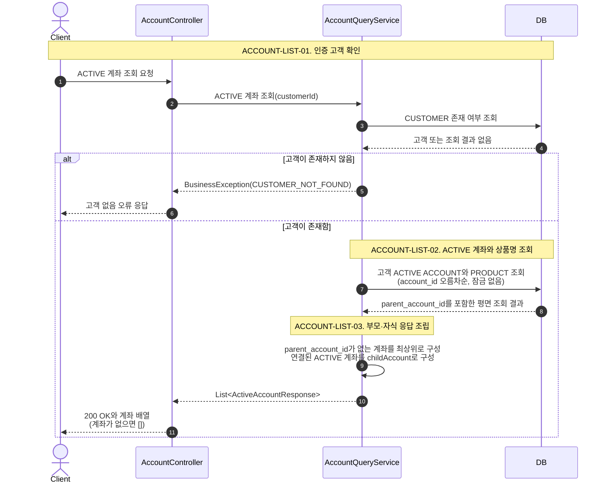
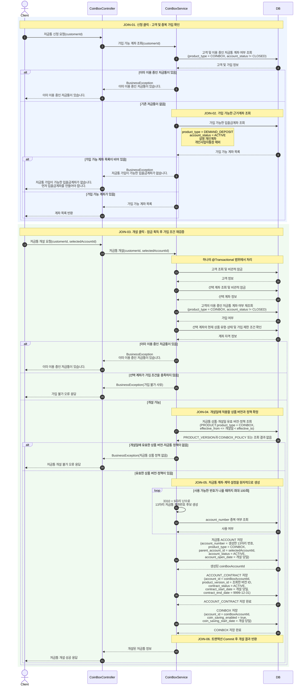
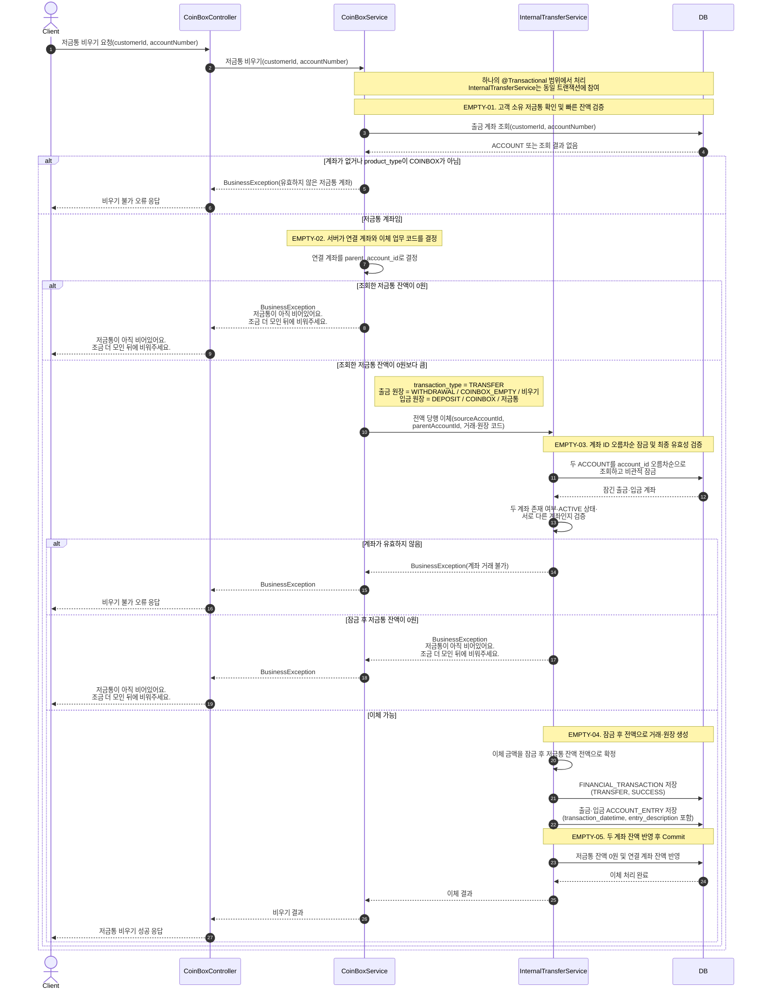
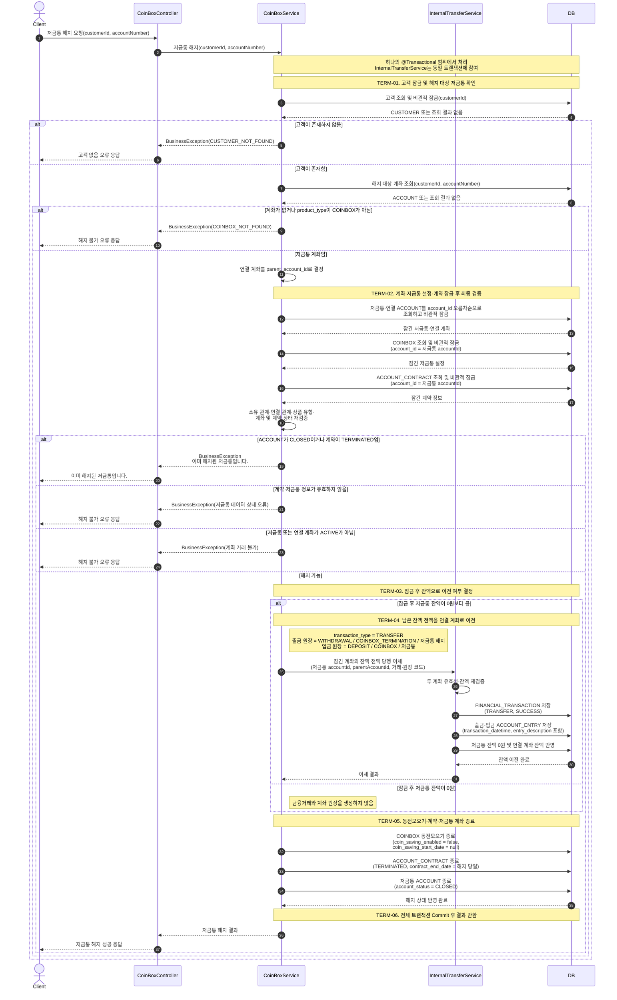
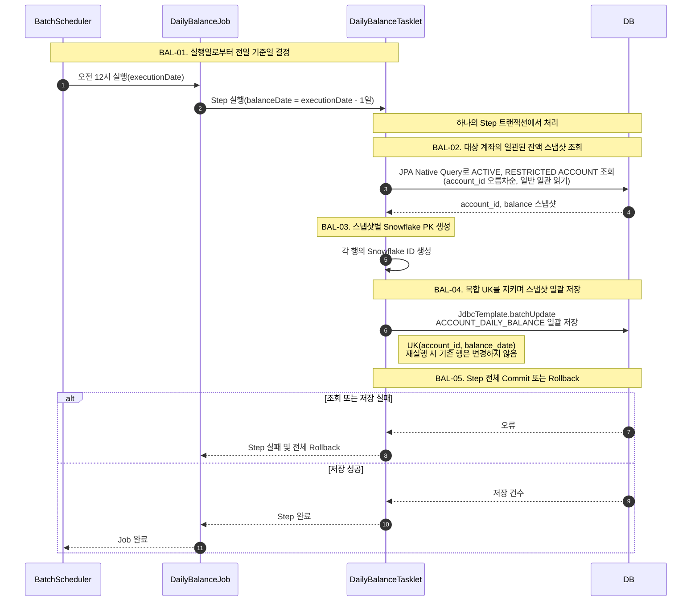
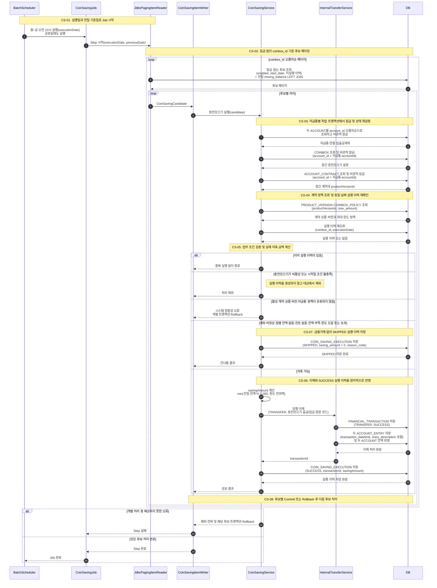

# 02. CoinBox Sequence Diagram

이 문서는 CoinBox 프로세스의 호출 순서, 분기, 잠금·트랜잭션 경계와 단계별 상세 COMMENT를 정의합니다.
테이블 구조는 [`01_ERD.md`](./01_ERD.md), 예시 데이터는 [`03_DATA_FLOW.md`](./03_DATA_FLOW.md),
HTTP·예외 설계는 [`05_API.md`](./05_API.md)를 참고합니다.

## 1. 참가자 구성

`Client`, `Server`, `DB`만 사용하는 구성도 전체 흐름을 설명하기에는 충분하지만,
서버 내부의 요청 처리와 업무 판단 책임이 모두 하나로 표현된다는 한계가 있습니다.

본 문서에서는 업무별 책임이 드러나도록 다음 참가자를 사용합니다.

| 참가자 | 책임 |
|---|---|
| `Client` | 사용자의 계좌 조회·신청·개설·비우기·해지 요청과 결과 화면 표시 |
| `AccountController` | 인증 고객의 계좌 조회 요청 수신과 계층형 응답 반환 |
| `AccountQueryService` | ACTIVE 계좌 조회 결과를 최상위·자식 계좌 구조로 조립 |
| `CoinBoxController` | 요청 수신, 입력값 검증, 응답 변환 |
| `CoinBoxService` | 가입 조건과 저금통 고유 규칙 검증, 개설·비우기·해지 흐름 조정 |
| `InternalTransferService` | 계좌 잠금, 계좌 유효성 검증, 거래·원장·잔액의 원자적 반영 |
| `BatchScheduler` | 정해진 시각에 일별 잔액 및 동전모으기 Job 실행 |
| `DailyBalanceTasklet` | 계좌 잔액 스냅샷 조회와 일괄 저장 |
| `JdbcPagingItemReader` | 동전모으기 후보를 잠금 없이 페이징 조회 |
| `CoinSavingItemWriter` / `CoinSavingService` | 후보별 독립 트랜잭션과 동전모으기 업무 규칙 처리 |
| `DB` | 고객·계좌·상품 버전·정책·계약·저금통 데이터 조회 및 저장 |

Repository를 별도 참가자로 추가하면 호출 관계는 더 자세히 표현할 수 있지만,
이 다이어그램의 목적은 클래스 호출 순서보다 주요 업무 흐름과 트랜잭션 경계를 설명하는 것입니다.
따라서 Repository는 생략하고 각 Service와 `DB` 사이의 데이터 접근으로 표현합니다.

---

## 2. 고객 ACTIVE 계좌 조회

고객 계좌 목록은 화면 표시를 위한 읽기 전용 조회입니다. ACTIVE 계좌와 상품명을 평면 데이터로 조회한 뒤
Service에서 `parent_account_id`를 기준으로 최상위 계좌와 `childAccount`를 조립합니다.

### 2.1 고객 ACTIVE 계좌 조회 상세 COMMENT

아래 단계 ID는 [`03_DATA_FLOW.md`](./03_DATA_FLOW.md#7-고객-active-계좌-조회)의 예시와 연결됩니다.

| 단계 | 상세 COMMENT |
|---|---|
| `ACCOUNT-LIST-01` | `customerId`는 요청값이 아니라 인증 문맥에서 가져옵니다. 고객 존재 여부를 먼저 확인하여 고객이 없을 때와 고객은 있지만 ACTIVE 계좌가 없을 때를 구분합니다. 이 API는 조회 전용이므로 비관적 잠금을 사용하지 않습니다. |
| `ACCOUNT-LIST-02` | `ACCOUNT.customer_id = customerId`, `account_status = ACTIVE`인 계좌를 조회하고 `ACCOUNT.product_type = PRODUCT.product_type`으로 상품명을 함께 가져옵니다. 계층 조립에 필요한 `parent_account_id`도 평면 조회 결과에 포함합니다. 최상위와 자식의 안정적인 응답 순서를 위해 `account_id` 오름차순으로 조회합니다. |
| `ACCOUNT-LIST-03` | `parent_account_id is null`인 계좌를 최상위 응답으로 만들고, 같은 결과 안에서 `parent_account_id`가 해당 최상위 `account_id`를 가리키는 계좌를 `childAccount`에 넣습니다. 자식이 없으면 빈 배열을 반환합니다. 부모가 조회 결과에 없는 자식이나 2단계 이상 중첩은 정상 모델에 어긋나는 정합성 오류이며 임의로 최상위로 승격하지 않습니다. |

---

## 3. 저금통 신규 가입

신규 가입은 가입 가능한 입출금계좌를 조회하는 `신청` 단계와,
선택한 입출금계좌를 근거계좌로 저금통을 생성하는 `개설` 단계로 구분합니다.

### 3.1 신규 가입 상세 COMMENT

아래 단계 ID는 Mermaid의 자동 순번과 별개로 유지되는 업무 식별자입니다. 같은 ID를
[`03_DATA_FLOW.md`](./03_DATA_FLOW.md#2-저금통-신규가입)의 예시 데이터와 연결하여 시퀀스의 판단과
데이터 변화를 함께 확인할 수 있도록 합니다.

| 단계 | 상세 COMMENT |
|---|---|
| `JOIN-01` | 신청 단계는 화면에 가입 가능한 계좌를 표시하기 위한 읽기 전용 사전 조회입니다. 고객이 현재 이용 중인 `COINBOX` 계좌를 이미 가지고 있는지 먼저 확인합니다. `account_status = CLOSED`인 과거 저금통은 이용 중인 저금통으로 판단하지 않습니다. 이 단계의 결과는 개설 시점까지 유효하다고 보장할 수 없으므로 개설 판단의 최종 근거로 사용하지 않습니다. |
| `JOIN-02` | 중복 가입이 아니라면 `product_type = DEMAND_DEPOSIT`, `account_status = ACTIVE`인 입출금계좌 중 저금통의 근거계좌가 될 수 있는 계좌를 반환합니다. 모임통장과 개인사업자통장은 제외합니다. 개인사업자통장 여부처럼 현재 ERD에 없는 가입 자격 정보는 계좌 가입 자격 조회 영역에서 제공되는 것으로 가정합니다. 조회 결과가 없으면 계좌 개설을 유도하는 업무 예외를 반환합니다. |
| `JOIN-03` | 사용자가 계좌를 선택한 뒤 실제 개설은 하나의 트랜잭션에서 수행합니다. `CUSTOMER`를 먼저 잠그고 선택한 `ACCOUNT`를 다음으로 잠급니다. 고객 잠금은 같은 고객의 동시 개설 요청을 직렬화하고, 계좌 잠금은 선택 이후 계좌 상태가 바뀌는 경쟁을 막습니다. 잠금을 획득한 뒤 고객당 이용 중인 저금통 존재 여부, 계좌 소유 관계, 상품 유형, 계좌 상태와 가입 제한 조건을 모두 다시 확인합니다. |
| `JOIN-04` | `PRODUCT.product_type = COINBOX`인 상품에서 개설일이 `PRODUCT_VERSION`의 `[effective_from, effective_to)` 범위에 포함되는 버전을 찾습니다. 해당 버전에 `COINBOX_POLICY`가 있어야 개설할 수 있습니다. 여기서 확정한 `product_version_id`를 계약에 저장하므로 이후 정책 조회는 가입일을 다시 계산하지 않고 계약이 참조하는 버전을 사용합니다. |
| `JOIN-05` | Snowflake로 저금통 계좌 ID, 계약 ID와 저금통 ID를 생성합니다. 계좌번호는 저금통 prefix `3310`과 9자리 난수를 조합한 13자리 후보로 만들고, 이미 사용 중이면 최대 100회까지 다시 생성합니다. 사전 중복 조회와 별개로 동시 요청의 경합은 `ACCOUNT.account_number` 유니크 제약이 최종 차단합니다. `ACCOUNT`에는 현재 운영 유형과 연결 입출금계좌를, `ACCOUNT_CONTRACT`에는 계약 당시의 상품 버전과 미종료일 `9999-12-31`을, `COINBOX`에는 고객별 동전모으기 설정을 저장합니다. 동전모으기는 개설 즉시 `true`로 설정하고 시작일은 개설 당일로 저장합니다. 세 행은 하나의 저금통을 서로 다른 책임으로 표현합니다. |
| `JOIN-06` | `ACCOUNT`, `ACCOUNT_CONTRACT`, `COINBOX`가 모두 저장된 경우에만 트랜잭션을 Commit하고 성공 결과를 반환합니다. 어느 하나라도 실패하면 전체를 Rollback하여 계좌만 존재하거나 계약·설정이 누락된 불완전한 저금통이 남지 않도록 합니다. 응답의 계좌 식별자와 계좌번호는 Commit된 `ACCOUNT`를 기준으로 합니다. |

> **트랜잭션 경계:** `JOIN-03`의 고객 잠금부터 `JOIN-06`의 세 데이터 저장 완료까지가 하나의
> 트랜잭션입니다. `JOIN-01`과 `JOIN-02`는 이 트랜잭션 밖에서 수행되는 사전 조회입니다.

---

## 4. 저금통 비우기

비우기 요청은 저금통 계좌번호만 전달받습니다. 입금 계좌는 클라이언트 요청값을 사용하지 않고
저금통 계좌의 `parent_account_id`로 결정합니다. 저금통 고유 조건을 검증한 후 실제 자금 이동은
공통 당행 이체 서비스에 위임합니다.

### 4.1 저금통 비우기 상세 COMMENT

아래 단계 ID는 [`03_DATA_FLOW.md`](./03_DATA_FLOW.md#3-저금통-비우기)의 동일한 ID와 연결됩니다.

| 단계 | 상세 COMMENT |
|---|---|
| `EMPTY-01` | `customerId`와 하이픈 없이 저장된 `accountNumber`를 함께 사용하여 요청 고객 소유의 계좌를 조회하고, `ACCOUNT.product_type = COINBOX`인지 확인합니다. 이때의 잔액 확인은 잔액이 0원인 요청을 빠르게 종료하기 위한 최적화입니다. 아직 계좌를 잠그지 않았으므로 조회한 잔액은 최종 이체 금액으로 사용하지 않습니다. |
| `EMPTY-02` | 입금 계좌는 Client가 지정하지 않고 저금통 `ACCOUNT.parent_account_id`로 결정합니다. 따라서 임의 계좌로 비우는 요청을 차단하고 개설 시 확정한 연결 관계를 유지합니다. 저금통 서비스는 거래 유형 `TRANSFER`와 출금·입금 계좌에 사용할 원장 코드 및 적요를 결정한 뒤 공통 당행 이체 서비스에 전달합니다. |
| `EMPTY-03` | 공통 당행 이체 서비스는 출금·입금 역할과 무관하게 두 `account_id`를 오름차순으로 정렬해 비관적 잠금을 획득합니다. 잠금 후 두 계좌의 존재 여부, `ACTIVE` 상태, 서로 다른 계좌인지와 출금 가능 잔액을 다시 검증합니다. `EMPTY-01`에서 읽은 객체나 잔액이 아니라 잠금 조회로 반환된 최신 계좌 상태를 사용합니다. 상품·계약 검증은 저금통 서비스에서 이미 확정한 업무 문맥이므로 공통 이체에서는 반복하지 않습니다. |
| `EMPTY-04` | 잠긴 저금통 계좌의 현재 잔액 전액을 이체 금액으로 확정합니다. 하나의 자금 이동을 `FINANCIAL_TRANSACTION` 한 행으로 기록하고, 계좌별 영향은 출금·입금 `ACCOUNT_ENTRY` 두 행으로 기록합니다. `amount`는 양수로 저장하고 방향은 `entry_type`으로 구분하며, 두 원장의 `transaction_datetime`은 거래의 `execution_datetime`과 동일합니다. |
| `EMPTY-05` | 저금통 잔액을 `0원`으로 만들고 동일 금액을 연결 입출금계좌에 더합니다. 금융거래, 두 원장과 두 계좌 잔액 변경은 같은 트랜잭션에서 Commit됩니다. 어느 한 작업이라도 실패하면 모두 Rollback하여 두 계좌 잔액 합계가 변하거나 거래·원장만 남는 상태를 방지합니다. 비우기는 계좌·계약을 해지하지 않으므로 `ACCOUNT` 상태, `ACCOUNT_CONTRACT`와 `COINBOX` 설정은 변경하지 않습니다. |

> **핵심 정합성:** 잠금 전 잔액은 빠른 실패를 위한 값이고, 잠금 후 잔액만 이체 금액과
> `balance_before`, `balance_after`를 계산하는 기준으로 사용합니다.

---

## 5. 저금통 해지

해지 요청은 고객 소유의 저금통인지 확인한 뒤 고객과 관련 계좌를 잠급니다. 남은 잔액이 있으면
`COINBOX_TERMINATION` 거래로 연결 입출금계좌에 전액 이전하고, 잔액이 없으면 금융거래 없이
계좌·계약·저금통 상태만 종료합니다.

### 5.1 저금통 해지 상세 COMMENT

아래 단계 ID는 [`03_DATA_FLOW.md`](./03_DATA_FLOW.md#4-저금통-해지)의 동일한 ID와 연결됩니다.

| 단계 | 상세 COMMENT |
|---|---|
| `TERM-01` | 해지 트랜잭션은 `CUSTOMER` 잠금으로 시작합니다. 이 잠금은 같은 고객의 신규가입과 해지 요청을 직렬화하여 해지가 완료되기 전에 새 저금통이 개설되는 경쟁을 막습니다. 고객이 없으면 `CUSTOMER_NOT_FOUND`를 반환합니다. 고객이 존재하면 `customerId`와 하이픈 없는 `accountNumber`로 고객 소유 계좌를 조회하고 `product_type = COINBOX`인지 확인하며, 계좌가 없거나 저금통이 아니면 `COINBOX_NOT_FOUND`를 반환합니다. |
| `TERM-02` | 저금통과 연결 입출금계좌를 `account_id` 오름차순으로 잠근 다음 `COINBOX`, 저금통의 `ACCOUNT_CONTRACT` 순서로 잠급니다. 잠금 후 고객 소유 관계, `parent_account_id` 연결 관계, 상품 유형, 두 계좌의 `ACTIVE` 상태, 계약의 `ACTIVE` 상태와 저금통 설정 존재 여부를 다시 검증합니다. 이미 `CLOSED` 또는 `TERMINATED`라면 일반 유효성 오류와 구분하여 `이미 해지된 저금통입니다.`를 반환합니다. |
| `TERM-03` | 모든 관련 행을 잠근 뒤 읽은 저금통 잔액으로 자금 이전 여부를 결정합니다. 잔액이 0원이면 금융거래와 계좌 원장을 생성하지 않고 종료 상태 변경으로 이동합니다. 잔액이 있다면 그 전액을 해지 이체 금액으로 확정합니다. 이자 계산과 지급은 과제 범위에 포함하지 않습니다. |
| `TERM-04` | 잔액이 있으면 이미 잠긴 두 계좌를 사용하는 공통 당행 이체 로직에 위임합니다. 거래 유형은 `TRANSFER`이고, 저금통 출금 원장은 `WITHDRAWAL / COINBOX_TERMINATION / 저금통 해지`, 연결 계좌 입금 원장은 `DEPOSIT / COINBOX / 저금통`으로 기록합니다. 금융거래 한 행과 계좌 원장 두 행을 생성하고 저금통 잔액을 0원으로 이전합니다. |
| `TERM-05` | 잔액 이전 후 `COINBOX.coin_saving_enabled = false`, `coin_saving_start_date = null`로 자동저축을 중단합니다. 계약은 `TERMINATED`와 실제 해지일로 종료하고, 저금통 계좌는 잔액 0원인 `CLOSED` 상태로 변경합니다. 연결 입출금계좌는 해지 대상이 아니므로 `ACTIVE`를 유지합니다. |
| `TERM-06` | 잔액 이전과 금융거래·원장 생성, 저금통 설정·계약·계좌 종료를 모두 하나의 트랜잭션으로 Commit합니다. 중간 작업 하나라도 실패하면 전부 Rollback하므로 잔액만 이전되고 저금통이 열려 있거나, 계좌만 닫히고 잔액이 남는 상태가 발생하지 않습니다. Commit 이후 같은 저금통으로 다시 요청하면 이미 해지된 저금통 예외를 반환합니다. |

> **잠금 순서:** 해지는 `CUSTOMER` → 두 `ACCOUNT`의 ID 오름차순 → `COINBOX` →
> `ACCOUNT_CONTRACT` 순서로 잠급니다. 다른 흐름에서도 공통으로 잠그는 여러 `ACCOUNT`는 항상 ID
> 오름차순을 사용해 반대 방향 업무 사이의 교착 가능성을 낮춥니다.

---

## 6. 일별 최종 잔액 배치

일별 잔액은 한 건씩 금융 업무를 처리하는 작업이 아니라 계좌 상태를 한 시점에 복제하는 작업입니다.
따라서 청크형 Reader/Processor/Writer 대신 Spring Batch Tasklet에서 JPA Native Query로 대상을 읽고
`JdbcTemplate`으로 신규 스냅샷을 일괄 저장합니다.

### 6.1 일별 최종 잔액 배치 상세 COMMENT

아래 단계 ID는 [`03_DATA_FLOW.md`](./03_DATA_FLOW.md#5-일별-최종-잔액-배치)의 동일한 ID와 연결됩니다.

| 단계 | 상세 COMMENT |
|---|---|
| `BAL-01` | Job은 매일 `00:00`에 실행하고 실행일의 전날을 `balanceDate`로 결정합니다. 예를 들어 `2026-08-28 00:00` 실행은 `balance_date = 2026-08-27`의 스냅샷을 생성합니다. 같은 기준일의 재실행도 동일한 `balanceDate`를 사용해야 중복 생성 방지 규칙이 작동합니다. |
| `BAL-02` | `DailyBalanceQueryRepository`의 JPA Native Query로 `account_status`가 `ACTIVE` 또는 `RESTRICTED`인 계좌의 `account_id`, `balance`를 일반 일관 읽기로 조회합니다. `CLOSED` 계좌는 제외하며 계좌에 비관적 잠금을 걸지 않습니다. 조회 SQL이 시작된 시점의 일관된 결과를 전일 최종 잔액으로 정의하므로, 스냅샷 이후에 Commit된 거래는 다음 기준일 데이터에 반영됩니다. |
| `BAL-03` | 모든 PK를 애플리케이션 Snowflake `Long`으로 생성한다는 원칙에 따라 조회된 계좌마다 `account_daily_balance_id`를 만듭니다. 이 제약 때문에 DB가 단독으로 행별 PK를 만들 수 없는 순수 `INSERT ... SELECT` 대신 애플리케이션에서 저장 행을 구성합니다. |
| `BAL-04` | 생성한 ID, `account_id`, `balanceDate`, `closing_balance`와 감사 일시를 `DailyBalanceJdbcRepository`의 `JdbcTemplate.batchUpdate`로 일괄 저장합니다. `(account_id, balance_date)` 복합 UK가 동일 계좌·기준일의 중복을 막습니다. 재실행 시 이미 존재하는 행은 성공 당시 잔액을 보존하고, 없는 행만 추가하는 멱등 방식으로 처리합니다. MySQL 연결의 `useAffectedRows=true`로 실제 신규 저장 건수만 Step 쓰기 건수에 반영합니다. |
| `BAL-05` | 조회와 일괄 저장은 하나의 Step 트랜잭션에서 실행합니다. 정상 처리되면 모든 신규 스냅샷을 함께 Commit하고, 조회 또는 저장 중 오류가 발생하면 해당 실행에서 추가한 행을 모두 Rollback합니다. 따라서 한 기준일의 대상 중 일부만 신규 저장된 상태를 정상 완료로 취급하지 않습니다. |

> **스냅샷 기준:** 달력상 정확히 `00:00:00`에 발생한 상태를 별도 마감 락으로 고정하는 것이 아니라,
> Step의 잔액 조회 SQL이 시작된 시점의 일관된 읽기를 전일 마감값으로 정의합니다.

---

## 7. 동전모으기 배치

동전모으기는 후보 조회와 실제 금융 처리를 분리합니다. 후보는 잠금 없이 효율적으로 페이징하고,
정합성은 저금통별 짧은 트랜잭션에서 계좌와 저금통을 잠근 뒤 재검증하여 보장합니다.

### 7.1 동전모으기 배치 상세 COMMENT

아래 단계 ID는 [`03_DATA_FLOW.md`](./03_DATA_FLOW.md#6-동전모으기-배치)의 동일한 ID와 연결됩니다.

| 단계 | 상세 COMMENT |
|---|---|
| `CS-01` | Job은 월요일부터 금요일까지 `10:00`에 실행하며 공휴일에도 동작합니다. `executionDate`는 실행 이력의 멱등성 기준일이고 `previousDate`는 저축 예정 금액을 계산할 일별 잔액 기준일입니다. 토요일과 일요일에는 Job 자체를 시작하지 않습니다. |
| `CS-02` | `JdbcPagingItemReader`는 `coinbox_id` 오름차순으로 기본 1,000건씩 후보를 조회합니다. 설정 활성, 시작일, 동일 날짜 실행 이력 부재를 1차 조건으로 사용하고 연결 입출금계좌의 전일 `closing_balance`를 함께 읽습니다. 후보 조회에는 잠금을 걸지 않으며 결과는 최종 실행 보장이 아니라 처리 대상을 줄이는 스냅샷입니다. 별도 ItemProcessor는 사용하지 않습니다. |
| `CS-03` | 각 후보는 독립 트랜잭션으로 처리합니다. 저금통과 연결 입출금계좌를 `account_id` 오름차순으로 잠근 뒤 `COINBOX`, 저금통의 `ACCOUNT_CONTRACT` 순서로 잠급니다. 잠금 후 두 계좌의 `ACTIVE` 상태, 연결 관계, 동전모으기 설정과 시작일 및 계약 상태를 다시 확인합니다. 후보 조회 이후 변경된 값은 잠금 후 값이 우선합니다. |
| `CS-04` | 활성 계약의 `product_version_id`로 `PRODUCT_VERSION`과 `COINBOX_POLICY.max_amount`를 조회합니다. 참조된 버전과 정책은 업무 값이 변경되지 않으므로 별도 잠금을 걸지 않습니다. `COINBOX` 잠금을 잡은 상태에서 `(coinbox_id, executionDate)` 실행 이력을 재조회하고, 이미 존재하면 아무 금융 처리도 하지 않습니다. 복합 UK가 동시에 들어온 중복 저장을 최종 차단합니다. |
| `CS-05` | 전일 잔액이 없거나 잔돈이 0원인지, 두 계좌가 정상인지, 실행 시점 연결 계좌 잔액이 1,000원보다 큰지, 저금통이 한도에 도달·초과했는지를 판단합니다. 기본 예정 금액은 `previousClosingBalance % 1,000`, 실제 금액은 `min(기본 예정 금액, 최대 한도 - 현재 저금통 잔액)`입니다. 모든 계산은 원 단위 `Long`으로 수행합니다. |
| `CS-06` | 저축 가능하면 연결 입출금계좌에서 저금통으로 실제 금액을 이체합니다. `FINANCIAL_TRANSACTION(TRANSFER, SUCCESS)`, 출금·입금 `ACCOUNT_ENTRY`, 두 계좌 잔액과 `COIN_SAVING_EXECUTION(SUCCESS)`을 같은 트랜잭션에 반영합니다. 실행 이력의 `transaction_id`는 생성된 금융거래를 가리키며 성공 사유 코드는 `null`입니다. |
| `CS-07` | 자금 이동이 불가능한 정상적인 업무 조건은 금융거래 없이 `COIN_SAVING_EXECUTION(SKIPPED, saving_amount = 0)`으로 남기고 원인을 `reason_code`로 기록합니다. 반면 후보 조회 후 설정이 비활성화되었거나 시작일 조건을 충족하지 않게 된 경우에는 삭제하기로 한 비활성 사유 코드를 만들지 않고 실행 이력 없이 처리 대상에서 제외합니다. |
| `CS-08` | `SUCCESS`와 `SKIPPED` 결과는 해당 후보의 독립 트랜잭션으로 Commit되어 다른 후보 결과와 분리됩니다. 예상하지 못한 오류가 발생하면 해당 후보의 금융 처리 전체를 Rollback하고 Step을 실패시킵니다. 현재 구현에는 자동 Retry·Skip과 `FAILED / SYSTEM_ERROR` 실행 이력 저장을 구성하지 않았으며, Spring Batch 재시작·복구 정책과 함께 운영 확장 범위로 남겨 둡니다. |

> **멱등성 방어:** 후보 조회의 실행 이력 부재 조건은 조회량을 줄이는 1차 방어이며,
> 잠금 후 재조회와 `UK(coinbox_id, execution_date)`가 실제 중복 이체를 막는 최종 방어입니다.
