# 04. CoinBox Class Diagram

이 문서는 ERD와 시퀀스 다이어그램을 구현한 현재 클래스 구조와 주요 의존 관계를 정의합니다.
메서드명과 반환형은 최종 소스 코드를 기준으로 하며, 프레임워크가 상속으로 제공하는 단순 CRUD는
업무 흐름 이해에 필요한 항목만 표시합니다.

---

## 1. 설계 원칙

- 온라인 요청과 배치 처리를 분리하여 다이어그램의 책임을 명확하게 표현합니다.
- `Controller → Service → Repository` 구조를 사용합니다.
- 엔티티 사이의 FK는 객체 연관관계가 아니라 Snowflake `Long` ID로 관리합니다.
- 다이어그램의 엔티티 간 점선은 논리적 참조를 의미하며 JPA 연관관계 매핑을 의미하지 않습니다.
- 단순 저장과 일반 조회는 Spring Data JPA Repository를 사용합니다.
- 온라인 복합 조인 조회는 전용 Query Repository의 JPA Native Query와 인터페이스 프로젝션을 사용합니다.
- `JdbcTemplate`은 배치의 대량 데이터 쓰기처럼 JPA보다 일괄 처리가 명확히 유리한 경우에 사용합니다.
- 금융거래 생성과 두 계좌 잔액 변경은 `InternalTransferService`에 집중합니다.
- 요청·응답 DTO의 세부 필드는 API 설계 단계에서 확정하며, 본 문서에서는 업무 흐름에 필요한 타입만 표시합니다.
- Enum의 저장값과 한글 설명은 [`01_ERD.md`](./01_ERD.md)를 기준으로 합니다.
- HTTP 요청·응답과 공통 예외 처리는 [`05_API.md`](./05_API.md)에서 별도로 정의합니다.

---

## 2. 배치 프로세스 클래스 다이어그램

일별 잔액은 Tasklet 한 단계로 처리하고, 동전모으기는 잠금 없는 페이징 Reader와
후보별 업무 트랜잭션을 수행하는 Writer·Service로 분리합니다.

```mermaid
classDiagram
    direction LR

    class BatchScheduler {
        <<Scheduler>>
        +launchDailyBalanceJob() void
        +launchCoinSavingJob() void
    }

    class ManualBatchController {
        <<Controller>>
        +executeDailyBalance(LocalDate executionDate) ManualBatchExecutionResponse
        +executeCoinSaving(LocalDate executionDate) ManualBatchExecutionResponse
    }

    class BatchExecutionService {
        <<Service>>
        +executeDailyBalance(LocalDate executionDate) BatchExecutionResult
        +executeCoinSaving(LocalDate executionDate) BatchExecutionResult
    }

    class BatchExecutionResult {
        <<ValueObject>>
        +String jobExecutionId
        +String jobName
        +BatchStatus status
        +LocalDate executionDate
    }

    class ManualBatchExecutionResponse {
        <<Response>>
        +String jobExecutionId
        +String jobName
        +BatchStatus status
        +LocalDate executionDate
    }

    class DailyBalanceJobConfig {
        <<BatchConfiguration>>
        +dailyBalanceJob() Job
        +dailyBalanceStep() Step
    }

    class DailyBalanceTasklet {
        <<Tasklet>>
        +execute(StepContribution contribution, ChunkContext context) RepeatStatus
    }

    class DailyBalanceQueryRepository {
        <<QueryRepository>>
        +findSnapshotTargets() List~AccountBalanceSnapshot~
    }

    class DailyBalanceJdbcRepository {
        <<JdbcRepository>>
        +batchInsertIfAbsent(List~DailyBalanceInsertRow~ rows) int
    }

    class AccountBalanceSnapshot {
        <<ReadModel>>
        +Long accountId
        +Long balance
    }

    class DailyBalanceInsertRow {
        <<WriteModel>>
        +Long accountDailyBalanceId
        +Long accountId
        +LocalDate balanceDate
        +Long closingBalance
        +LocalDateTime createdDatetime
        +LocalDateTime updatedDatetime
    }

    class AccountDailyBalance {
        <<Entity>>
        +Long accountDailyBalanceId
        +Long accountId
        +LocalDate balanceDate
        +Long closingBalance
    }

    class CoinSavingJobConfig {
        <<BatchConfiguration>>
        +coinSavingJob() Job
        +coinSavingStep() Step
        +coinSavingReader() JdbcPagingItemReader~CoinSavingCandidate~
    }

    class JdbcPagingItemReader~CoinSavingCandidate~ {
        <<SpringBatchReader>>
        +read() CoinSavingCandidate
    }

    class CoinSavingItemWriter {
        <<ItemWriter>>
        +write(Chunk~CoinSavingCandidate~ candidates) void
    }

    class CoinSavingCandidate {
        <<ReadModel>>
        +Long coinBoxId
        +Long coinBoxAccountId
        +Long parentAccountId
        +Long previousClosingBalance
        +LocalDate executionDate
    }

    class CoinSavingService {
        <<Service>>
        +execute(CoinSavingCandidate candidate) CoinSavingResult
        -saveSkipped(Long coinBoxId, LocalDate executionDate, CoinSavingReasonCode reasonCode) CoinSavingResult
        -validateRelationships(CoinSavingCandidate candidate, Account parent, Account coinBox, CoinBox setting) void
    }

    class CoinSavingAmountCalculator {
        <<DomainService>>
        +calculate(Long previousClosingBalance, Long currentSourceBalance, Long currentCoinBoxBalance, Long maxAmount) CoinSavingCalculation
    }

    class CoinSavingCalculation {
        <<ValueObject>>
        +boolean transferable
        +Long savingAmount
        +CoinSavingReasonCode reasonCode
    }

    class CoinSavingExecutionRepository {
        <<Repository>>
        +existsByCoinBoxIdAndExecutionDate(Long coinBoxId, LocalDate executionDate) boolean
        +save(CoinSavingExecution execution) CoinSavingExecution
    }

    class CoinSavingExecution {
        <<Entity>>
        +Long executionId
        +Long coinBoxId
        +Long transactionId
        +LocalDate executionDate
        +Long savingAmount
        +CoinSavingExecutionStatus executionStatus
        +CoinSavingReasonCode reasonCode
    }

    class AccountRepository {
        <<Repository>>
        +findAllByIdForUpdateOrderByAccountId(List~Long~ accountIds) List~Account~
    }

    class CoinBoxRepository {
        <<Repository>>
        +findByAccountIdForUpdate(Long accountId) Optional~CoinBox~
    }

    class AccountContractRepository {
        <<Repository>>
        +findLatestByAccountIdForUpdate(Long accountId) Optional~AccountContract~
    }

    class CoinBoxPolicyQueryRepository {
        <<QueryRepository>>
        +findByProductVersionId(Long productVersionId) Optional~CoinBoxPolicySnapshot~
    }

    class InternalTransferService {
        <<SharedService>>
        +transfer(Long sourceId, Long targetId, Long amount, TransferLedgerSpec ledgerSpec) TransferResult
    }

    class Snowflake {
        <<Infrastructure>>
        +nextId() Long
    }

    ManualBatchController --> BatchExecutionService
    ManualBatchController ..> ManualBatchExecutionResponse
    BatchScheduler --> BatchExecutionService
    BatchExecutionService --> DailyBalanceJobConfig
    BatchExecutionService --> CoinSavingJobConfig
    BatchExecutionService ..> BatchExecutionResult

    DailyBalanceJobConfig --> DailyBalanceTasklet
    DailyBalanceTasklet --> DailyBalanceQueryRepository
    DailyBalanceTasklet --> DailyBalanceJdbcRepository
    DailyBalanceTasklet --> Snowflake
    DailyBalanceTasklet ..> DailyBalanceInsertRow
    DailyBalanceQueryRepository ..> AccountBalanceSnapshot
    DailyBalanceJdbcRepository ..> DailyBalanceInsertRow

    CoinSavingJobConfig --> JdbcPagingItemReader~CoinSavingCandidate~
    CoinSavingJobConfig --> CoinSavingItemWriter
    JdbcPagingItemReader~CoinSavingCandidate~ ..> CoinSavingCandidate
    CoinSavingItemWriter --> CoinSavingService
    CoinSavingItemWriter ..> CoinSavingCandidate

    CoinSavingService --> AccountRepository
    CoinSavingService --> CoinBoxRepository
    CoinSavingService --> AccountContractRepository
    CoinSavingService --> CoinBoxPolicyQueryRepository
    CoinSavingService --> CoinSavingExecutionRepository
    CoinSavingService --> CoinSavingAmountCalculator
    CoinSavingService --> InternalTransferService
    CoinSavingService --> Snowflake
    CoinSavingAmountCalculator ..> CoinSavingCalculation
    CoinSavingExecutionRepository ..> CoinSavingExecution
```

### 2.1 배치 클래스 책임

| 클래스 | 핵심 책임 | 관련 단계 |
|---|---|---|
| `ManualBatchController` | 필수 `executionDate`를 검증하고 일별 잔액 또는 동전모으기 Job의 수동 실행 결과를 반환합니다. | `BAL-01`, `CS-01` |
| `BatchScheduler` | 서울 시간 기준 실행 일정에 맞춰 현재 날짜를 공통 실행 서비스에 전달합니다. | `BAL-01`, `CS-01` |
| `BatchExecutionService` | 자동·수동 호출에 같은 Job 파라미터를 구성하고 실행별 식별자·상태를 반환합니다. Job과 Step의 자체 트랜잭션을 방해하지 않도록 외부 업무 트랜잭션을 시작하지 않습니다. | `BAL-01`, `CS-01` |
| `DailyBalanceJobConfig` | 일별 잔액 Job과 단일 Tasklet Step을 구성합니다. | `BAL-*` |
| `DailyBalanceTasklet` | 기준일 계산 결과를 받아 대상 조회, Snowflake ID 생성과 일괄 저장을 조정합니다. | `BAL-02~05` |
| `DailyBalanceQueryRepository` | JPA Native Query로 `ACTIVE`, `RESTRICTED` 계좌의 잔액을 잠금 없이 ID 순서로 조회합니다. | `BAL-02` |
| `DailyBalanceJdbcRepository` | 복합 UK를 기준으로 기존 스냅샷은 보존하고 신규 스냅샷만 JDBC 일괄 저장합니다. | `BAL-04` |
| `CoinSavingJobConfig` | `JdbcPagingItemReader`와 `CoinSavingItemWriter`로 Chunk Step을 구성하며 기본 페이지는 1,000건, 청크는 1건으로 설정합니다. | `CS-01~02` |
| `JdbcPagingItemReader<CoinSavingCandidate>` | `coinbox_id` 오름차순으로 잠금 없는 후보 조회를 수행하고 전일 잔액을 후보에 포함합니다. | `CS-02` |
| `CoinSavingItemWriter` | 후보를 순회하며 저금통별 업무 서비스를 호출합니다. 업무 조회나 금액 계산은 수행하지 않습니다. | `CS-03~08` |
| `CoinSavingService` | 잠금, 상태·계약·정책·실행 이력 재검증과 성공·건너뜀 실행 이력 저장을 조정합니다. | `CS-03~08` |
| `CoinSavingAmountCalculator` | DB 접근 없이 전일 잔돈, 실행 시점 잔액과 한도로 실제 저축액 또는 건너뜀 사유를 계산합니다. | `CS-05` |
| `CoinSavingExecutionRepository` | 실행 이력 재확인과 `SUCCESS`, `SKIPPED` 결과 저장을 담당합니다. | `CS-04`, `CS-06~07` |
| `InternalTransferService` | 온라인 프로세스와 같은 계좌 잠금·거래·원장·잔액 처리 규칙을 재사용합니다. | `CS-06` |

### 2.2 배치 트랜잭션 경계

| 처리 | 트랜잭션 범위 |
|---|---|
| 자동·수동 Job 시작 | `BatchExecutionService`는 외부 트랜잭션 없이 Job을 시작하고 각 Job·Step이 자체 트랜잭션 경계를 관리합니다. |
| 일별 최종 잔액 | Tasklet의 대상 조회부터 `ACCOUNT_DAILY_BALANCE` 일괄 저장까지 하나의 Step 트랜잭션 |
| 동전모으기 후보 조회 | 비관적 잠금이 없는 페이징 조회. 후보를 확정하는 트랜잭션이 아닙니다. |
| 동전모으기 후보 1건 | 청크 크기 1을 기준으로 계좌·설정·계약 잠금부터 `SUCCESS` 또는 `SKIPPED` 실행 이력 저장까지 독립 트랜잭션 |
| 동전모으기 시스템 오류 | 해당 후보의 업무 변경 전체 Rollback 후 Step 실패. 자동 Retry·Skip과 실패 이력 저장은 현재 범위에서 제외 |

---

## 3. 온라인 프로세스 클래스 다이어그램

계좌 목록은 `AccountQueryService`가 읽기 모델을 계층형 응답으로 조립합니다. 신규가입, 비우기와 해지는
`CoinBoxService`가 저금통 고유 규칙을 조정하고 실제 계좌 간 자금 이동은 `InternalTransferService`에 위임합니다.

```mermaid
classDiagram
    direction LR

    class AccountController {
        <<Controller>>
        +findActiveAccounts(Long customerId) List~ActiveAccountResponse~
    }

    class AccountQueryService {
        <<Service>>
        +findActiveAccounts(Long customerId) List~ActiveAccountResponse~
        -assembleHierarchy(List~ActiveAccountRow~ rows) List~ActiveAccountResponse~
    }

    class AccountQueryRepository {
        <<QueryRepository>>
        +findActiveAccounts(Long customerId) List~ActiveAccountRow~
    }

    class ActiveAccountRow {
        <<ReadModel>>
        +Long accountId
        +ProductType productType
        +String accountNumber
        +Long balance
        +String productName
        +Long parentAccountId
    }

    class ActiveAccountResponse {
        <<Response>>
        +String accountId
        +ProductType productType
        +String accountNumber
        +Long balance
        +String productName
        +List~ChildAccountResponse~ childAccount
    }

    class ChildAccountResponse {
        <<Response>>
        +String accountId
        +ProductType productType
        +String accountNumber
        +Long balance
        +String productName
    }

    class EligibleAccountsResponse {
        <<Response>>
        +List~EligibleAccountResponse~ accounts
    }

    class EligibleAccountResponse {
        <<Response>>
        +String accountId
        +String accountNumber
        +ProductType productType
        +Long balance
    }

    class OpenCoinBoxRequest {
        <<Request>>
        +Long parentAccountId
    }

    class OpenCoinBoxResponse {
        <<Response>>
        +String accountId
        +String accountNumber
        +ProductType productType
        +AccountStatus accountStatus
        +String parentAccountId
        +boolean coinSavingEnabled
        +LocalDate coinSavingStartDate
        +LocalDate accountOpenDate
    }

    class EmptyCoinBoxResponse {
        <<Response>>
        +String transactionId
        +Long amount
        +Long coinBoxBalanceAfter
        +Long parentAccountBalanceAfter
    }

    class TerminateCoinBoxResponse {
        <<Response>>
        +String accountId
        +String accountNumber
        +AccountStatus accountStatus
        +ContractStatus contractStatus
        +Long transferredAmount
        +LocalDate terminationDate
    }

    class CoinBoxController {
        <<Controller>>
        +findEligibleAccounts(Long customerId) EligibleAccountsResponse
        +openCoinBox(Long customerId, OpenCoinBoxRequest request) ResponseEntity~OpenCoinBoxResponse~
        +emptyCoinBox(Long customerId, String accountNumber) EmptyCoinBoxResponse
        +terminateCoinBox(Long customerId, String accountNumber) TerminateCoinBoxResponse
    }

    class CoinBoxService {
        <<Service>>
        +findEligibleAccounts(Long customerId) List~Account~
        +openCoinBox(Long customerId, Long selectedAccountId) CoinBoxOpenResult
        +emptyCoinBox(Long customerId, String accountNumber) TransferResult
        +terminateCoinBox(Long customerId, String accountNumber) CoinBoxTerminationResult
        -validateEligibleParentAccount(Long customerId, Account account) void
        -validateTerminationState(Long customerId, Account coinBox, Account parent, AccountContract contract) void
    }

    class InternalTransferService {
        <<Service>>
        +transfer(Long sourceId, Long targetId, Long amount, TransferLedgerSpec ledgerSpec) TransferResult
        +transferAll(Long sourceId, Long targetId, TransferLedgerSpec ledgerSpec) TransferResult
        -lockAndValidateAccounts(Long sourceId, Long targetId) LockedAccounts
        -executeTransfer(Account source, Account target, Long amount, TransferLedgerSpec ledgerSpec) TransferResult
    }

    class AccountNumberGenerator {
        <<Service>>
        +generate(ProductType productType) String
        -resolvePrefix(ProductType productType) String
    }

    class TransferLedgerSpec {
        <<ValueObject>>
        +EntryCode sourceEntryCode
        +String sourceDescription
        +EntryCode targetEntryCode
        +String targetDescription
    }

    class TransferResult {
        <<ValueObject>>
        +Long transactionId
        +Long amount
        +Long sourceBalanceAfter
        +Long targetBalanceAfter
    }

    class CoinBoxOpenResult {
        <<ValueObject>>
        +Account account
        +CoinBox coinBox
    }

    class CoinBoxTerminationResult {
        <<ValueObject>>
        +Account account
        +AccountContract accountContract
        +Long transferredAmount
        +LocalDate terminationDate
    }

    class CustomerRepository {
        <<Repository>>
        +existsById(Long customerId) boolean
        +findByIdForUpdate(Long customerId) Optional~Customer~
    }

    class AccountRepository {
        <<Repository>>
        +findEligibleDemandDepositAccounts(Long customerId) List~Account~
        +findByCustomerIdAndAccountNumber(Long customerId, String accountNumber) Optional~Account~
        +findAllByIdForUpdateOrderByAccountId(List~Long~ accountIds) List~Account~
        +countNonClosedCoinBoxes(Long customerId) long
        +countByAccountNumber(String accountNumber) long
        +save(Account account) Account
    }

    class AccountContractRepository {
        <<Repository>>
        +findLatestByAccountIdForUpdate(Long accountId) Optional~AccountContract~
        +save(AccountContract contract) AccountContract
    }

    class CoinBoxRepository {
        <<Repository>>
        +findByAccountIdForUpdate(Long accountId) Optional~CoinBox~
        +save(CoinBox coinBox) CoinBox
    }

    class CoinBoxPolicyQueryRepository {
        <<QueryRepository>>
        +findEffectivePolicy(LocalDate date) Optional~CoinBoxPolicySnapshot~
        +findByProductVersionId(Long productVersionId) Optional~CoinBoxPolicySnapshot~
    }

    class FinancialTransactionRepository {
        <<Repository>>
        +save(FinancialTransaction transaction) FinancialTransaction
    }

    class AccountEntryRepository {
        <<Repository>>
        +saveAll(List~AccountEntry~ entries) List~AccountEntry~
    }

    class Snowflake {
        <<Infrastructure>>
        +nextId() Long
    }

    class Customer {
        <<Entity>>
        +Long customerId
        +CustomerStatus customerStatus
    }

    class Account {
        <<Entity>>
        +Long accountId
        +Long customerId
        +ProductType productType
        +String accountNumber
        +Long parentAccountId
        +Long balance
        +AccountStatus accountStatus
        +LocalDate accountOpenDate
        +debit(Long amount) void
        +credit(Long amount) void
        +close() void
    }

    class AccountContract {
        <<Entity>>
        +Long accountContractId
        +Long accountId
        +Long productVersionId
        +ContractStatus contractStatus
        +LocalDate contractStartDate
        +LocalDate contractEndDate
        +terminate(LocalDate terminationDate) void
    }

    class CoinBox {
        <<Entity>>
        +Long coinBoxId
        +Long accountId
        +boolean coinSavingEnabled
        +LocalDate coinSavingStartDate
        +disableCoinSaving() void
    }

    class CoinBoxPolicySnapshot {
        <<ReadModel>>
        +Long productVersionId
        +Long coinBoxPolicyId
        +Long maxAmount
    }

    class FinancialTransaction {
        <<Entity>>
        +Long transactionId
        +TransactionType transactionType
        +Long transactionAmount
        +TransactionStatus transactionStatus
        +LocalDateTime executionDatetime
    }

    class AccountEntry {
        <<Entity>>
        +Long entryId
        +Long accountId
        +Long transactionId
        +EntryType entryType
        +EntryCode entryCode
        +Long amount
        +Long balanceBefore
        +Long balanceAfter
        +LocalDateTime transactionDatetime
        +String entryDescription
    }

    AccountController --> AccountQueryService
    AccountQueryService --> CustomerRepository
    AccountQueryService --> AccountQueryRepository
    AccountQueryService ..> ActiveAccountResponse
    AccountQueryService ..> ChildAccountResponse
    AccountQueryRepository ..> ActiveAccountRow

    CoinBoxController --> CoinBoxService
    CoinBoxController ..> OpenCoinBoxRequest
    CoinBoxController ..> EligibleAccountsResponse
    CoinBoxController ..> OpenCoinBoxResponse
    CoinBoxController ..> EmptyCoinBoxResponse
    CoinBoxController ..> TerminateCoinBoxResponse
    CoinBoxService --> AccountNumberGenerator : 계좌번호 채번
    CoinBoxService --> InternalTransferService : 비우기·해지
    CoinBoxService --> CustomerRepository
    CoinBoxService --> AccountRepository
    CoinBoxService --> AccountContractRepository
    CoinBoxService --> CoinBoxRepository
    CoinBoxService --> CoinBoxPolicyQueryRepository
    CoinBoxService --> Snowflake
    CoinBoxService ..> CoinBoxOpenResult
    CoinBoxService ..> CoinBoxTerminationResult

    InternalTransferService --> AccountRepository
    InternalTransferService --> FinancialTransactionRepository
    InternalTransferService --> AccountEntryRepository
    InternalTransferService --> Snowflake
    InternalTransferService ..> TransferLedgerSpec
    InternalTransferService ..> TransferResult

    AccountNumberGenerator --> AccountRepository

    CustomerRepository ..> Customer
    AccountRepository ..> Account
    AccountContractRepository ..> AccountContract
    CoinBoxRepository ..> CoinBox
    CoinBoxPolicyQueryRepository ..> CoinBoxPolicySnapshot
    FinancialTransactionRepository ..> FinancialTransaction
    AccountEntryRepository ..> AccountEntry

    Account ..> Account : parentAccountId
    AccountContract ..> Account : accountId
    CoinBox ..> Account : accountId
    AccountEntry ..> Account : accountId
    AccountEntry ..> FinancialTransaction : transactionId
```

### 3.1 온라인 클래스 책임

| 클래스 | 핵심 책임 | 관련 프로세스 |
|---|---|---|
| `AccountController` | 인증 고객의 ACTIVE 계좌 조회 요청을 받고 계층형 계좌 배열을 반환합니다. | `ACCOUNT-LIST-*` |
| `AccountQueryService` | 고객 존재 여부를 확인하고 평면 계좌 조회 결과를 최상위 계좌와 `childAccount` 구조로 조립합니다. | `ACCOUNT-LIST-01~03` |
| `AccountQueryRepository` | JPA Native Query로 ACTIVE 계좌, 상품명과 `parent_account_id`를 한 번에 조회하고 읽기 모델로 반환합니다. | `ACCOUNT-LIST-02` |
| `CoinBoxController` | 요청값 수신, DTO 변환과 결과 응답. 업무 판단은 수행하지 않습니다. | 가입, 비우기, 해지 |
| `CoinBoxService` | 저금통 고유 가입 조건, 고객당 1개 제약, 상품 정책 선택, 연결 관계와 해지 상태를 검증하고 전체 흐름을 조정합니다. | `JOIN-*`, `EMPTY-01~02`, `TERM-*` |
| `AccountNumberGenerator` | 상품별 4자리 prefix와 9자리 난수로 13자리 계좌번호 후보를 만들고 기존 번호와 충돌하면 재채번합니다. DB 유니크 제약이 동시 요청의 최종 중복을 차단합니다. | `JOIN-05` |
| `InternalTransferService` | 계좌 ID 오름차순 잠금, 계좌 상태와 잔액 검증, 금융거래·원장·잔액의 원자적 반영을 담당합니다. | `EMPTY-03~05`, `TERM-04`, `CS-06` |
| `TransferLedgerSpec` | 동일한 이체 로직에서 비우기·동전모으기·해지의 원장 코드와 통장 적요를 다르게 전달합니다. | 비우기, 동전모으기, 해지 |
| `CustomerRepository` | 고객 잠금으로 동일 고객의 가입·해지 경쟁을 직렬화합니다. | `JOIN-03`, `TERM-01` |
| `AccountRepository` | `DEMAND_DEPOSIT`만을 대상으로 하는 가입 가능 계좌 조회, 고객 소유 계좌 조회와 계좌 ID 오름차순 잠금 조회를 담당합니다. | 모든 온라인 프로세스 |
| `CoinBoxPolicyQueryRepository` | JPA Native Query로 `PRODUCT`, `PRODUCT_VERSION`, `COINBOX_POLICY`를 조인하고 읽기 모델로 반환하여 Service의 조인 세부사항을 숨깁니다. | `JOIN-04`, `CS-04` |
| `AccountContractRepository` | 계약 생성 및 해지 시 활성 계약 잠금·종료를 담당합니다. | `JOIN-05`, `TERM-02·05` |
| `CoinBoxRepository` | 저금통 설정 생성 및 동전모으기 설정 잠금·종료를 담당합니다. | `JOIN-05`, `TERM-02·05` |
| `FinancialTransactionRepository` | 하나의 자금 이동을 나타내는 금융거래 헤더를 저장합니다. | 비우기, 동전모으기, 해지 |
| `AccountEntryRepository` | 출금·입금 계좌별 원장 두 건을 저장합니다. | 비우기, 동전모으기, 해지 |

### 3.2 온라인 트랜잭션 경계

| Service 메서드 | 트랜잭션 범위 |
|---|---|
| `AccountQueryService.findActiveAccounts` | 잠금 없는 읽기 전용 트랜잭션에서 고객 확인, ACTIVE 계좌·상품 조회와 응답 조립을 수행합니다. |
| `CoinBoxService.openCoinBox` | 고객·선택 계좌 잠금부터 `ACCOUNT`, `ACCOUNT_CONTRACT`, `COINBOX` 생성까지 |
| `CoinBoxService.emptyCoinBox` | 저금통 검증부터 `InternalTransferService.transferAll`의 거래·원장·잔액 반영까지 |
| `CoinBoxService.terminateCoinBox` | 고객·계좌·설정·계약 잠금, 필요 시 잔액 이전, 계좌·계약·설정 종료까지 |
| `InternalTransferService` | 호출한 온라인 트랜잭션에 참여하며, 단독 이체 호출 시에도 동일한 원자성 경계를 제공합니다. |

---

## 4. Persistence 책임

| 클래스 | 주요 조회 테이블 | 주요 변경 테이블 |
|---|---|---|
| `AccountQueryService` / `AccountQueryRepository` | `CUSTOMER`, `ACCOUNT`, `PRODUCT` | 없음 |
| `CoinBoxService` | `CUSTOMER`, `ACCOUNT`, `PRODUCT`, `PRODUCT_VERSION`, `COINBOX_POLICY`, `COINBOX`, `ACCOUNT_CONTRACT` | 가입 시 `ACCOUNT`, `ACCOUNT_CONTRACT`, `COINBOX`; 해지 시 세 테이블의 상태 |
| `InternalTransferService` | 잠금 대상 `ACCOUNT` | `ACCOUNT`, `FINANCIAL_TRANSACTION`, `ACCOUNT_ENTRY` |
| `DailyBalanceQueryRepository` | `ACCOUNT` | 없음 |
| `DailyBalanceJdbcRepository` | 없음 | `ACCOUNT_DAILY_BALANCE` |
| `JdbcPagingItemReader<CoinSavingCandidate>` | `COINBOX`, 저금통·연결 `ACCOUNT`, `ACCOUNT_DAILY_BALANCE`, `COIN_SAVING_EXECUTION` | 없음 |
| `CoinSavingService` | 잠금 대상 `ACCOUNT`, `COINBOX`, `ACCOUNT_CONTRACT`; 조회 전용 `PRODUCT_VERSION`, `COINBOX_POLICY`; 실행 이력 | `COIN_SAVING_EXECUTION` 및 `InternalTransferService`가 변경하는 거래·원장·계좌 |

---

## 5. 프로세스 추적표

| 프로세스 단계 | 진입 클래스 | 핵심 처리 클래스 | 데이터 결과 |
|---|---|---|---|
| `ACCOUNT-LIST-01~03` | `AccountController` | `AccountQueryService`, `AccountQueryRepository` | ACTIVE 계좌와 자식 계좌의 계층형 조회 결과 반환 |
| `JOIN-01~02` | `CoinBoxController` | `CoinBoxService`, `AccountRepository` | 조회 결과만 반환 |
| `JOIN-03~06` | `CoinBoxController` | `CoinBoxService` | `ACCOUNT`, `ACCOUNT_CONTRACT`, `COINBOX` 생성 |
| `EMPTY-01~02` | `CoinBoxController` | `CoinBoxService` | 저금통 검증 및 이체 명령 구성 |
| `EMPTY-03~05` | `CoinBoxService` | `InternalTransferService` | 금융거래·원장 생성 및 두 계좌 잔액 변경 |
| `BAL-01~05` | `BatchScheduler` 또는 `ManualBatchController` | `BatchExecutionService`, `DailyBalanceTasklet`, `DailyBalanceQueryRepository`, `DailyBalanceJdbcRepository` | `ACCOUNT_DAILY_BALANCE` 생성 |
| `CS-01~02` | `BatchScheduler` 또는 `ManualBatchController` | `BatchExecutionService`, `CoinSavingJobConfig`, `JdbcPagingItemReader` | 잠금 없는 후보 스트림 |
| `CS-03~08` | `CoinSavingItemWriter` | `CoinSavingService`, `CoinSavingAmountCalculator`, `InternalTransferService` | 성공 거래·원장·실행 이력 또는 건너뜀 실행 이력 |
| `TERM-01~03` | `CoinBoxController` | `CoinBoxService` | 해지 대상 잠금·검증 및 잔액 분기 |
| `TERM-04~06` | `CoinBoxService` | `InternalTransferService`, `CoinBoxService` | 필요 시 잔액 이전 후 계좌·계약·설정 종료 |

---

## 6. 구현 시 주의사항

- Repository가 반환한 엔티티 사이에 `@ManyToOne`, `@OneToMany` 등을 추가하지 않고 FK는 `Long`으로 유지합니다.
- ACTIVE 계좌 목록은 계좌별 상품 조회를 반복하지 않고 `ACCOUNT`와 `PRODUCT`를 한 번에 조회한 평면
  읽기 모델을 JPA Native Query 프로젝션으로 만든 뒤 Service에서 그룹핑하여 N+1 조회를 방지합니다.
- 잠금 조회 메서드는 다이어그램에 표시된 순서를 보장해야 하며, 여러 계좌는 SQL의 `order by account_id`와
  비관적 쓰기 잠금을 함께 사용합니다.
- `InternalTransferService`의 출금·입금 원장 생성은 한쪽만 성공할 수 없도록 같은 트랜잭션에서 수행합니다.
- `CoinSavingAmountCalculator`는 Repository에 의존하지 않는 순수 계산 클래스로 두어 한도 경계값과
  `SKIPPED` 사유를 단위 테스트하기 쉽게 만듭니다.
- `CoinBoxPolicyQueryRepository`는 상품 관련 세 테이블의 조인 결과를 읽기 모델로 반환하되,
  계약에는 조회 결과 전체가 아니라 `product_version_id`만 저장합니다.
- `ACCOUNT_DAILY_BALANCE`와 `COIN_SAVING_EXECUTION`의 복합 UK를 애플리케이션 사전 조회만으로
  대체하지 않고 DB의 최종 정합성 제약으로 유지합니다.
