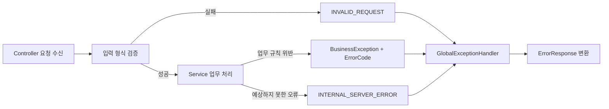

# 05. CoinBox API Design

이 문서는 CoinBox 온라인 API와 로컬 테스트용 수동 실행 API의 요청·응답 계약, 입력 검증, 오류 코드와 공통 예외
처리 방식을 정의합니다.
업무 처리 순서와 트랜잭션 경계는 [`02_SEQUENCE_DIAGRAM.md`](./02_SEQUENCE_DIAGRAM.md), 데이터 구조와 Enum은
[`01_ERD.md`](./01_ERD.md), 단계별 데이터 변화는 [`03_DATA_FLOW.md`](./03_DATA_FLOW.md)를 참고합니다.

배치는 채점과 개발 검증을 위한 수동 실행만 HTTP API로 제공합니다. Job 조회·중지·재시작과 일반 운영자
관리 기능은 현재 과제 범위에서 제외합니다.

---

## 1. 공통 규칙

| 항목 | 규칙 |
|---|---|
| Base URL | 고객 온라인 API는 `/api/v1`, 로컬 테스트용 수동 실행 API는 `/internal/v1`을 사용합니다. |
| 인증 고객 | 현재 과제에서는 인증 계층이 검증해 전달한 것으로 가정하는 `X-Customer-Id` 헤더에서 `customerId`를 획득합니다. 요청 본문이나 경로로 받은 고객 식별자는 사용하지 않습니다. 실제 운영 환경에서는 Client가 헤더를 임의 지정하지 못하도록 인증·게이트웨이 계층이 값을 생성해야 합니다. |
| 식별자 | Snowflake `Long`은 JavaScript의 정수 정밀도 손실을 막기 위해 JSON에서 문자열로 반환합니다. `X-Customer-Id`도 HTTP 문자열 헤더와 OpenAPI `string` 스키마로 명세합니다. |
| 계좌번호 | 요청과 DB 저장값 모두 하이픈 없는 13자리 숫자 문자열을 사용합니다. 입력 형식은 `^[0-9]{13}$`로 검증합니다. 입출금계좌는 `3333`, 저금통은 `3310`, 모임통장은 `7979`로 시작하며 화면 표시용 하이픈은 Client가 적용합니다. |
| 금액 | 원 단위 정수이며 JSON 숫자로 표현합니다. 음수 금액은 사용하지 않습니다. |
| 날짜 | 날짜는 `yyyy-MM-dd`, 일시는 ISO 8601 형식을 사용합니다. |
| Content-Type | 요청 본문과 성공·오류 응답은 `application/json`을 사용합니다. |
| 성공 응답 | 업무 결과 DTO를 응답 본문으로 반환합니다. DB Commit이 완료된 뒤에만 성공으로 응답합니다. |
| 실패 응답 | 모든 HTTP API는 7절의 `ErrorResponse` 형식을 사용합니다. |
| OpenAPI JSON | 실행 중인 애플리케이션의 `/v3/api-docs`에서 확인합니다. |
| Swagger UI | 실행 중인 애플리케이션의 `/swagger-ui.html`에서 확인합니다. |

### 1.1 Swagger/OpenAPI 사용 원칙

- Springdoc은 이 문서에 정의된 온라인 API 다섯 경로, 수동 배치 실행 API 두 경로와 테스트 잔고 충전 API 한 경로를 OpenAPI 3.1
  명세로 생성합니다. 내부 Service와 Job 중지·재시작 기능은 노출하지 않습니다.
- Swagger UI의 고객 온라인 Operation에는 필수 `X-Customer-Id` 헤더 입력이 표시됩니다. 이 헤더는 API
  Key나 실제 인증 수단이 아니라 인증·게이트웨이 계층이 검증 후 전달한다고 가정한 고객 식별자입니다.
- `/internal`의 수동 실행 API는 고객 업무가 아니므로 `X-Customer-Id`를 사용하지 않습니다. 이 경로는
  과제에서 용도를 구분하기 위한 것으로 실제 인증·인가를 구현한 것은 아니며, 운영 환경에서는 관리자
  인증과 내부망 또는 게이트웨이 접근 제어가 필요합니다.
- 요청·응답의 Snowflake ID는 JSON 문자열로, 금액은 원 단위 정수로 명세합니다.
- `401 Unauthorized`는 향후 보안 계층의 책임이므로 현재 애플리케이션이 생성하는 응답 명세에는
  포함하지 않습니다.

---

## 2. 고객 ACTIVE 계좌 조회 API

```http
GET /api/v1/accounts
X-Customer-Id: 700000000000000001
```

인증 고객이 현재 보유한 `ACTIVE` 계좌를 조회합니다. `parent_account_id`가 없는 계좌를 최상위 배열에
배치하고, 해당 계좌를 근거계좌로 참조하는 `ACTIVE` 계좌는 `childAccount` 배열에 포함합니다.
`productName`은 `ACCOUNT.product_type = PRODUCT.product_type`으로 연결한 상품명입니다.

#### 성공 응답 — `200 OK`

```json
[
  {
    "accountId": "710000000000000001",
    "productType": "DEMAND_DEPOSIT",
    "accountNumber": "3333000000001",
    "balance": 253400,
    "productName": "입출금통장",
    "childAccount": [
      {
        "accountId": "710000000000000002",
        "productType": "COINBOX",
        "accountNumber": "3310000000001",
        "balance": 48730,
        "productName": "저금통"
      }
    ]
  }
]
```

#### 조회 및 응답 규칙

| 항목 | 규칙 |
|---|---|
| 조회 대상 | 인증 고객 소유이며 `account_status = ACTIVE`인 계좌만 조회합니다. |
| 최상위 계좌 | `parent_account_id is null`인 ACTIVE 계좌입니다. |
| 자식 계좌 | `parent_account_id`가 최상위 계좌의 `account_id`를 참조하는 ACTIVE 계좌입니다. 현재 모델은 1단계 자식까지만 허용합니다. |
| 상품명 | `PRODUCT.product_type`을 이용해 조회하며 상품 기준 정보가 없으면 정합성 오류로 처리합니다. |
| 정렬 | 최상위 계좌와 각 `childAccount`는 각각 `account_id` 오름차순으로 반환합니다. |
| 빈 결과 | 고객은 존재하지만 ACTIVE 계좌가 없으면 `200 OK`와 빈 배열 `[]`을 반환합니다. |
| 자식 없는 계좌 | `childAccount`를 생략하거나 `null`로 반환하지 않고 빈 배열 `[]`을 반환합니다. |

활성 자식 계좌는 활성 최상위 계좌 아래에만 반환합니다. 부모가 없거나 ACTIVE가 아닌데 자식만 ACTIVE인
상태는 정상 업무 흐름에서 발생하지 않아야 하는 데이터 정합성 오류로 간주하며, 임의로 최상위 계좌로
승격하지 않습니다. 이 조회는 화면 표시용 읽기 전용 API이므로 계좌 잠금은 사용하지 않습니다.

#### 주요 오류

| 오류 코드 | 발생 조건 |
|---|---|
| `CUSTOMER_NOT_FOUND` | 인증 고객을 찾을 수 없음 |
| `INTERNAL_SERVER_ERROR` | 계좌의 상품 기준 정보가 없거나 부모·자식 관계가 유효하지 않은 정합성 오류 |

---

## 3. 저금통 신규 가입 API

### 3.1 가입 가능한 근거계좌 조회

```http
GET /api/v1/coinboxes/eligible-accounts
X-Customer-Id: 700000000000000002
```

인증 고객에게 이미 이용 중인 저금통이 없는지 확인하고, 저금통 개설이 가능한 입출금계좌를 반환합니다.
이 결과는 화면 표시를 위한 사전 조회이며 실제 개설 시 모든 가입 조건을 잠금 후 다시 검증합니다.

#### 성공 응답 — `200 OK`

```json
{
  "accounts": [
    {
      "accountId": "710000000000000004",
      "accountNumber": "3333000000003",
      "productType": "DEMAND_DEPOSIT",
      "balance": 125670
    }
  ]
}
```

#### 주요 오류

| 오류 코드 | 발생 조건 |
|---|---|
| `CUSTOMER_NOT_FOUND` | 인증 고객을 찾을 수 없음 |
| `CUSTOMER_NOT_ELIGIBLE` | 고객 상태가 저금통 가입 조건을 충족하지 않음 |
| `COINBOX_ALREADY_EXISTS` | 고객에게 `CLOSED`가 아닌 저금통 계좌가 이미 있음 |
| `ELIGIBLE_ACCOUNT_NOT_FOUND` | 가입 가능한 입출금계좌가 한 건도 없음 |

### 3.2 저금통 개설

```http
POST /api/v1/coinboxes
X-Customer-Id: 700000000000000003
```

#### 요청 본문

```json
{
  "parentAccountId": "710000000000000005"
}
```

#### 성공 응답 — `201 Created`

```json
{
  "accountId": "710000000000000101",
  "accountNumber": "3310000000003",
  "productType": "COINBOX",
  "accountStatus": "ACTIVE",
  "parentAccountId": "710000000000000005",
  "coinSavingEnabled": true,
  "coinSavingStartDate": "2026-08-30",
  "accountOpenDate": "2026-08-30"
}
```

개설 성공 시 `ACCOUNT`, `ACCOUNT_CONTRACT`, `COINBOX`가 하나의 트랜잭션에서 함께 생성됩니다.
활성 계약의 `contract_end_date`는 `9999-12-31`, 동전모으기 시작일은 개설 당일로 저장합니다.

#### 주요 오류

| 오류 코드 | 발생 조건 |
|---|---|
| `CUSTOMER_NOT_FOUND` | 인증 고객을 찾을 수 없음 |
| `CUSTOMER_NOT_ELIGIBLE` | 고객 상태가 저금통 가입 조건을 충족하지 않음 |
| `COINBOX_ALREADY_EXISTS` | 잠금 후 재확인한 시점에 이용 중인 저금통이 이미 있음 |
| `ACCOUNT_NOT_FOUND` | 선택한 근거계좌를 찾을 수 없거나 인증 고객의 계좌가 아님 |
| `ACCOUNT_NOT_ELIGIBLE` | 선택 계좌가 상품 유형·상태 또는 가입 제한 조건을 충족하지 않음 |
| `ACCOUNT_NUMBER_GENERATION_FAILED` | 제한된 재시도 안에 사용 가능한 13자리 저금통 계좌번호를 만들지 못함 |
| `COINBOX_POLICY_NOT_FOUND` | 개설일에 적용할 저금통 상품 버전 또는 정책이 없음 |

---

## 4. 저금통 비우기 API

```http
POST /api/v1/coinboxes/3310000000001/empty
X-Customer-Id: 700000000000000001
```

저금통 계좌의 현재 잔액 전액을 서버가 `parent_account_id`로 확인한 연결 입출금계좌로 이체합니다.
입금 계좌와 이체 금액은 Client가 지정하지 않습니다.

#### 성공 응답 — `200 OK`

```json
{
  "transactionId": "770000000000000001",
  "amount": 48730,
  "coinBoxBalanceAfter": 0,
  "parentAccountBalanceAfter": 302130
}
```

#### 주요 오류

| 오류 코드 | 발생 조건 |
|---|---|
| `COINBOX_NOT_FOUND` | 인증 고객 소유의 유효한 저금통 계좌가 아님 |
| `COINBOX_BALANCE_EMPTY` | 잠금 후 확정한 저금통 잔액이 0원임 |
| `COINBOX_INVALID_STATE` | 저금통에 연결 입출금계좌가 없는 등 데이터 연결 상태가 올바르지 않음 |
| `ACCOUNT_NOT_TRANSFERABLE` | 저금통 또는 연결 입출금계좌가 정상 거래 상태가 아님 |

---

## 5. 저금통 해지 API

```http
DELETE /api/v1/coinboxes/3310000000002
X-Customer-Id: 700000000000000004
```

잔액이 있으면 `COINBOX_TERMINATION` 원장 코드로 연결 입출금계좌에 전액 이전한 뒤 저금통을 해지합니다.
잔액이 0원이면 금융거래와 계좌 원장을 만들지 않고 해지 상태만 반영합니다.

#### 성공 응답 — `200 OK`

```json
{
  "accountId": "710000000000000007",
  "accountNumber": "3310000000002",
  "accountStatus": "CLOSED",
  "contractStatus": "TERMINATED",
  "transferredAmount": 35270,
  "terminationDate": "2026-08-30"
}
```

#### 주요 오류

| 오류 코드 | 발생 조건 |
|---|---|
| `COINBOX_NOT_FOUND` | 인증 고객 소유의 저금통 계좌를 찾을 수 없거나 상품 유형이 저금통이 아님 |
| `COINBOX_ALREADY_TERMINATED` | 계좌가 `CLOSED`이거나 계약이 `TERMINATED`인 저금통에 다시 해지를 요청함 |
| `COINBOX_INVALID_STATE` | 계좌·계약·저금통 설정 또는 연결 관계가 올바른 데이터 구성을 충족하지 않음 |
| `ACCOUNT_NOT_TRANSFERABLE` | 잔액 이전이 필요한데 저금통 또는 연결 입출금계좌가 정상 거래 상태가 아님 |

---

## 6. 로컬 테스트 수동 실행 API

배치 수동 실행 API는 서버가 정한 현재 날짜를 암묵적으로 사용하지 않고 `executionDate`를 필수로 받습니다.
따라서 채점자와 개발자가 같은 업무 기준일을 반복해서 실행하고 결과를 확인할 수 있습니다. 자동
스케줄러도 동일한 `BatchExecutionService`를 사용하므로 날짜 파라미터와 Job 처리 규칙은 같습니다.

### 6.1 일별 최종 잔액 배치 실행

```http
POST /internal/v1/batches/daily-balance?executionDate=2026-08-30
```

`executionDate`의 전날인 `2026-08-29`를 `balanceDate`로 사용하여 `dailyBalanceJob`을 실행합니다.

### 6.2 동전모으기 배치 실행

```http
POST /internal/v1/batches/coin-saving?executionDate=2026-08-30
```

`executionDate`를 실행 이력 기준일로, 전날을 `previousDate`로 사용하여 `coinSavingJob`을 실행합니다.
수동 실행은 요일을 제한하지 않으므로 주말 날짜도 명시적으로 실행할 수 있으며, 평일만 자동 실행하는
스케줄 규칙과 구분합니다.

#### 성공 응답 — `200 OK`

```json
{
  "jobExecutionId": "1",
  "jobName": "dailyBalanceJob",
  "status": "COMPLETED",
  "executionDate": "2026-08-30"
}
```

| 필드 | 타입 | 의미 |
|---|---|---|
| `jobExecutionId` | `string` | Spring Batch가 생성한 Job 실행 식별자 |
| `jobName` | `string` | `dailyBalanceJob` 또는 `coinSavingJob` |
| `status` | `string` | 응답 시점의 Spring Batch 실행 상태입니다. 기본 동기 실행에서는 정상 완료 시 `COMPLETED`입니다. |
| `executionDate` | `string` | 요청에서 지정한 업무 실행일 |

#### 실행 규칙과 제한

| 항목 | 규칙 |
|---|---|
| 실행일 | `yyyy-MM-dd` 형식의 `executionDate`가 반드시 필요합니다. 누락하거나 변환할 수 없으면 `400 / INVALID_REQUEST`를 반환합니다. |
| 실행 방식 | 요청 스레드에서 Job을 즉시 시작하고 실행 결과를 반환합니다. Job 시작 자체에서 예외가 발생하면 `500 / INTERNAL_SERVER_ERROR`를 반환합니다. |
| 동일 날짜 재실행 | `launchedAt`과 `launchSequence`로 Spring Batch 실행을 구분하고, 업무 데이터는 각 복합 UK와 재검증 규칙으로 중복 생성을 방지합니다. |
| 제공 범위 | 신규 실행만 제공하며 Job 목록 조회, 중지, 실패 Job 재시작과 메타데이터 수정 API는 제공하지 않습니다. |
| 접근 통제 | 현재 과제에는 인증·인가가 없으므로 로컬 검증 용도입니다. 운영 환경에서는 관리자 권한과 내부 접근 제어가 필요합니다. |

### 6.3 테스트 전용 입출금계좌 잔고 충전

```http
POST /internal/v1/test-account-deposits
Content-Type: application/json
```

```json
{
  "accountNumber": "3333000000003",
  "amount": 10000
}
```

#### 성공 응답 — `200 OK`

```json
{
  "accountNumber": "3333000000003",
  "depositedAmount": 10000,
  "balanceAfter": 135670
}
```

이 API는 Swagger와 로컬 실행에서 테스트 잔고를 준비하기 위한 보조 기능입니다. 지정 계좌가
`DEMAND_DEPOSIT`인지 확인한 뒤 `ACCOUNT.balance = balance + amount` UPDATE만 실행합니다. 계좌 상태와
계약은 확인하지 않으며 비관적 잠금도 사용하지 않습니다. 실제 금융 입금이나 이체가 아니므로
`FINANCIAL_TRANSACTION`과 `ACCOUNT_ENTRY`는 생성하지 않습니다. 운영 환경에 노출해서는 안 됩니다.

---

## 7. 공통 오류 응답

```json
{
  "status": 409,
  "code": "COINBOX_ALREADY_EXISTS",
  "message": "이미 이용 중인 저금통이 있습니다.",
  "timestamp": "2026-08-27T10:15:30"
}
```

| 필드 | 타입 | 의미 |
|---|---|---|
| `status` | `number` | HTTP 상태 코드 |
| `code` | `string` | Client가 분기 처리할 수 있는 변경되지 않는 업무 오류 코드 |
| `message` | `string` | 사용자에게 표시할 수 있는 한글 오류 메시지 |
| `timestamp` | `string` | 오류 응답을 생성한 일시 |

### 7.1 오류 코드

| HTTP 상태 | 오류 코드 | 기본 메시지 |
|---:|---|---|
| `400 Bad Request` | `INVALID_REQUEST` | 잘못된 요청입니다. |
| `400 Bad Request` | `CUSTOMER_NOT_ELIGIBLE` | 저금통 가입이 가능한 고객 상태가 아닙니다. |
| `404 Not Found` | `CUSTOMER_NOT_FOUND` | 고객을 찾을 수 없습니다. |
| `404 Not Found` | `ACCOUNT_NOT_FOUND` | 계좌를 찾을 수 없습니다. |
| `409 Conflict` | `ELIGIBLE_ACCOUNT_NOT_FOUND` | 저금통 가입이 가능한 입출금계좌가 없습니다. 먼저 입출금계좌를 만들어야 합니다. |
| `409 Conflict` | `ACCOUNT_NOT_ELIGIBLE` | 선택한 계좌는 저금통 가입 조건을 충족하지 않습니다. |
| `409 Conflict` | `ACCOUNT_NOT_TRANSFERABLE` | 계좌 거래가 불가능한 상태입니다. |
| `409 Conflict` | `TEST_BALANCE_DEPOSIT_NOT_ALLOWED` | 입출금계좌만 테스트 잔고를 증가시킬 수 있습니다. |
| `409 Conflict` | `INSUFFICIENT_ACCOUNT_BALANCE` | 계좌 잔액이 부족합니다. |
| `404 Not Found` | `COINBOX_NOT_FOUND` | 유효한 저금통 계좌를 찾을 수 없습니다. |
| `409 Conflict` | `COINBOX_ALREADY_EXISTS` | 이미 이용 중인 저금통이 있습니다. |
| `409 Conflict` | `COINBOX_BALANCE_EMPTY` | 저금통이 아직 비어있어요. 조금 더 모인 뒤에 비워주세요. |
| `409 Conflict` | `COINBOX_ALREADY_TERMINATED` | 이미 해지된 저금통입니다. |
| `409 Conflict` | `COINBOX_INVALID_STATE` | 저금통 데이터 상태가 올바르지 않습니다. |
| `503 Service Unavailable` | `COINBOX_POLICY_NOT_FOUND` | 현재 적용 가능한 저금통 상품 정책이 없습니다. |
| `500 Internal Server Error` | `ACCOUNT_NUMBER_GENERATION_FAILED` | 사용 가능한 계좌번호를 생성하지 못했습니다. |
| `500 Internal Server Error` | `INTERNAL_SERVER_ERROR` | 서버 내부 오류가 발생했습니다. |

`COIN_SAVING_EXECUTION.reason_code`는 배치 처리 결과를 기록하는 데이터 값이며 HTTP 오류 코드가 아닙니다.
특히 동전모으기 비활성 상태는 후보 조회에서 제외하므로 별도의 오류 코드나 `CoinSavingReasonCode`로 관리하지 않습니다.

---

## 8. 입력 검증

| 대상 | 검증 규칙 | 실패 처리 |
|---|---|---|
| `parentAccountId` | 필수이며 Snowflake `Long`으로 변환 가능한 양의 정수 문자열 | `400 / INVALID_REQUEST` |
| `accountNumber` | 필수이며 하이픈 없는 13자리 숫자 문자열 | `400 / INVALID_REQUEST` |
| `executionDate` | 배치 수동 실행 시 필수이며 `yyyy-MM-dd`로 변환 가능한 날짜 | `400 / INVALID_REQUEST` |
| 테스트 잔고 충전 `amount` | 필수이며 0보다 큰 원 단위 정수 | `400 / INVALID_REQUEST` |
| JSON 본문 | 필수 필드 누락, 형식 오류와 알 수 없는 타입 값 검증 | `400 / INVALID_REQUEST` |
| 인증 정보 | 인증되지 않은 요청은 보안 계층에서 차단 | `401 Unauthorized` |

형식 검증은 Controller 진입 단계에서 처리합니다. 계좌 소유 관계, 계좌 상태, 중복 가입과 같은
현재 데이터에 따른 판단은 Service가 잠금 및 트랜잭션 경계 안에서 처리합니다.

---

## 9. 예외 처리 설계



- Service는 업무 규칙 위반에 해당하는 `ErrorCode`를 선택해 하나의 `BusinessException`으로 전달합니다.
- `GlobalExceptionHandler`는 업무 예외, 입력 변환·검증 예외와 예상하지 못한 예외를 공통
  `ErrorResponse`로 변환합니다.
- 업무 예외가 트랜잭션 안에서 발생하면 해당 트랜잭션을 Rollback한 뒤 오류를 응답합니다.
- 예상하지 못한 예외의 상세 메시지와 스택 트레이스는 서버 로그에만 남기고 Client에는
  `INTERNAL_SERVER_ERROR`의 일반 메시지만 반환합니다.
- 오류 응답 생성 실패나 예외 로깅이 원래 업무 예외를 덮어쓰지 않도록 합니다.

---

## 10. 중복 요청과 멱등성

| 요청 | 처리 원칙 |
|---|---|
| 고객 ACTIVE 계좌 조회 | 읽기 전용이며 반복 호출은 데이터를 변경하지 않습니다. 각 호출 시점에 Commit된 최신 계좌 상태와 잔액을 반환합니다. |
| 가입 가능 계좌 조회 | 읽기 전용이므로 반복 호출해도 데이터를 변경하지 않습니다. |
| 저금통 개설 | 고객 비관적 잠금과 고객당 이용 중인 저금통 검증으로 동시 중복 개설을 막습니다. 최초 요청 성공 후 반복 요청은 `COINBOX_ALREADY_EXISTS`가 됩니다. |
| 저금통 비우기 | 최초 성공 후 저금통 잔액이 0원이므로 반복 요청은 `COINBOX_BALANCE_EMPTY`가 됩니다. 동일 요청에 같은 성공 응답을 재생하는 별도 Idempotency-Key는 현재 범위에서 다루지 않습니다. |
| 저금통 해지 | 최초 성공 후 반복 요청은 `COINBOX_ALREADY_TERMINATED`가 됩니다. 사용자 요구에 따라 이미 해지된 요청을 성공으로 간주하지 않습니다. |
| 일별 최종 잔액 수동 실행 | 같은 실행일을 다시 실행해도 `(account_id, balance_date)` 복합 UK를 기준으로 기존 스냅샷을 변경하지 않고 없는 행만 저장합니다. |
| 동전모으기 수동 실행 | 같은 실행일을 다시 실행해도 잠금 후 실행 이력 재조회와 `UK(coinbox_id, execution_date)`가 중복 이체를 방지합니다. |
| 테스트 전용 잔고 충전 | 멱등 요청이 아니며 같은 요청을 반복하면 요청 금액만큼 잔고가 매번 증가합니다. 테스트 데이터 준비에만 사용합니다. |

저금통 온라인 변경 요청과 동전모으기의 최종 판단은 사전 조회 결과가 아니라 시퀀스 다이어그램에 정의된
비관적 잠금 이후의 최신 데이터로 수행합니다. 일별 최종 잔액은 복합 UK와 중복 무시 저장으로 같은
기준일의 재실행을 방어합니다. 테스트 전용 잔고 충전은 이 정합성 규칙의 적용 대상이 아닙니다.
