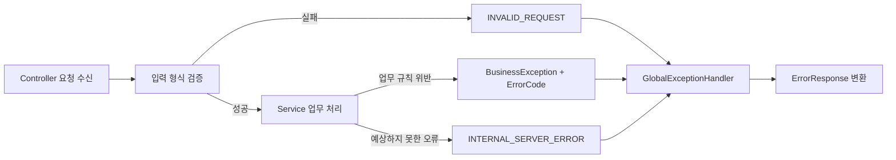

# CoinBox API Design

이 문서는 CoinBox 온라인 API의 요청·응답 계약, 입력 검증, 오류 코드와 공통 예외 처리 방식을 정의한다.
업무 처리 순서와 트랜잭션 경계는 [`SEQUENCE_DIAGRAM.md`](./SEQUENCE_DIAGRAM.md), 데이터 구조와 Enum은
[`ERD.md`](./ERD.md), 단계별 데이터 변화는 [`DATA_FLOW.md`](./DATA_FLOW.md)를 참고한다.

배치 Job의 실행·재시작 API와 운영자 API는 현재 과제 범위에서 제외한다.

---

## 1. 공통 규칙

| 항목 | 규칙 |
|---|---|
| Base URL | `/api/v1` |
| 인증 고객 | `customerId`는 인증 정보에서 획득한다. 요청 본문이나 경로로 받은 고객 식별자를 신뢰하지 않는다. 시퀀스 다이어그램의 `customerId`는 이 인증 문맥을 명시한 표현이다. |
| 식별자 | Snowflake `Long`은 JavaScript의 정수 정밀도 손실을 막기 위해 JSON에서 문자열로 반환한다. |
| 계좌번호 | 요청과 DB 저장값 모두 하이픈 없는 숫자 문자열을 사용한다. 입력 형식은 `^[0-9]+$`로 검증한다. 화면 표시용 하이픈은 Client가 적용한다. |
| 금액 | 원 단위 정수이며 JSON 숫자로 표현한다. 음수 금액은 사용하지 않는다. |
| 날짜 | 날짜는 `yyyy-MM-dd`, 일시는 ISO 8601 형식을 사용한다. |
| 성공 응답 | 업무 결과 DTO를 응답 본문으로 반환한다. DB Commit이 완료된 뒤에만 성공으로 응답한다. |
| 실패 응답 | 모든 온라인 API는 5절의 `ErrorResponse` 형식을 사용한다. |

---

## 2. 저금통 신규 가입 API

### 2.1 가입 가능한 근거계좌 조회

```http
GET /api/v1/coinboxes/eligible-accounts
```

인증 고객에게 이미 이용 중인 저금통이 없는지 확인하고, 저금통 개설이 가능한 입출금계좌를 반환한다.
이 결과는 화면 표시를 위한 사전 조회이며 실제 개설 시 모든 가입 조건을 잠금 후 다시 검증한다.

#### 성공 응답 — `200 OK`

```json
{
  "accounts": [
    {
      "accountId": "710000000000000001",
      "accountNumber": "3333123456789",
      "productType": "DEMAND_DEPOSIT",
      "balance": 245670
    }
  ]
}
```

#### 주요 오류

| 오류 코드 | 발생 조건 |
|---|---|
| `CUSTOMER_NOT_FOUND` | 인증 고객을 찾을 수 없음 |
| `COINBOX_ALREADY_EXISTS` | 고객에게 `CLOSED`가 아닌 저금통 계좌가 이미 있음 |
| `ELIGIBLE_ACCOUNT_NOT_FOUND` | 가입 가능한 입출금계좌가 한 건도 없음 |

### 2.2 저금통 개설

```http
POST /api/v1/coinboxes
```

#### 요청 본문

```json
{
  "parentAccountId": "710000000000000001"
}
```

#### 성공 응답 — `201 Created`

```json
{
  "accountId": "710000000000000101",
  "accountNumber": "7777000012345",
  "productType": "COINBOX",
  "accountStatus": "ACTIVE",
  "parentAccountId": "710000000000000001",
  "coinSavingEnabled": true,
  "coinSavingStartDate": "2026-08-27",
  "accountOpenDate": "2026-08-27"
}
```

개설 성공 시 `ACCOUNT`, `ACCOUNT_CONTRACT`, `COINBOX`가 하나의 트랜잭션에서 함께 생성된다.
활성 계약의 `contract_end_date`는 `9999-12-31`, 동전모으기 시작일은 개설 당일로 저장한다.

#### 주요 오류

| 오류 코드 | 발생 조건 |
|---|---|
| `CUSTOMER_NOT_FOUND` | 인증 고객을 찾을 수 없음 |
| `COINBOX_ALREADY_EXISTS` | 잠금 후 재확인한 시점에 이용 중인 저금통이 이미 있음 |
| `ACCOUNT_NOT_FOUND` | 선택한 근거계좌를 찾을 수 없거나 인증 고객의 계좌가 아님 |
| `ACCOUNT_NOT_ELIGIBLE` | 선택 계좌가 상품 유형·상태 또는 가입 제한 조건을 충족하지 않음 |
| `COINBOX_POLICY_NOT_FOUND` | 개설일에 적용할 저금통 상품 버전 또는 정책이 없음 |

---

## 3. 저금통 비우기 API

```http
POST /api/v1/coinboxes/{accountNumber}/empty
```

저금통 계좌의 현재 잔액 전액을 서버가 `parent_account_id`로 확인한 연결 입출금계좌로 이체한다.
입금 계좌와 이체 금액은 Client가 지정하지 않는다.

#### 성공 응답 — `200 OK`

```json
{
  "transactionId": "720000000000000001",
  "amount": 4360,
  "coinBoxBalanceAfter": 0,
  "parentAccountBalanceAfter": 250030
}
```

#### 주요 오류

| 오류 코드 | 발생 조건 |
|---|---|
| `COINBOX_NOT_FOUND` | 인증 고객 소유의 유효한 저금통 계좌가 아님 |
| `COINBOX_BALANCE_EMPTY` | 잠금 후 확정한 저금통 잔액이 0원임 |
| `ACCOUNT_NOT_TRANSFERABLE` | 저금통 또는 연결 입출금계좌가 정상 거래 상태가 아님 |

---

## 4. 저금통 해지 API

```http
DELETE /api/v1/coinboxes/{accountNumber}
```

잔액이 있으면 `COINBOX_TERMINATION` 원장 코드로 연결 입출금계좌에 전액 이전한 뒤 저금통을 해지한다.
잔액이 0원이면 금융거래와 계좌 원장을 만들지 않고 해지 상태만 반영한다.

#### 성공 응답 — `200 OK`

```json
{
  "accountId": "710000000000000101",
  "accountNumber": "7777000012345",
  "accountStatus": "CLOSED",
  "contractStatus": "TERMINATED",
  "transferredAmount": 4360,
  "terminationDate": "2026-08-27"
}
```

#### 주요 오류

| 오류 코드 | 발생 조건 |
|---|---|
| `COINBOX_NOT_FOUND` | 인증 고객 소유의 저금통 계좌를 찾을 수 없거나 상품 유형이 저금통이 아님 |
| `COINBOX_ALREADY_TERMINATED` | 계좌가 `CLOSED`이거나 계약이 `TERMINATED`인 저금통에 다시 해지를 요청함 |
| `COINBOX_INVALID_STATE` | 계좌·계약·저금통 설정 또는 연결 관계가 해지 가능한 데이터 구성을 충족하지 않음 |
| `ACCOUNT_NOT_TRANSFERABLE` | 잔액 이전이 필요한데 저금통 또는 연결 입출금계좌가 정상 거래 상태가 아님 |

---

## 5. 공통 오류 응답

```json
{
  "status": 409,
  "code": "COINBOX_ALREADY_EXISTS",
  "message": "이미 이용 중인 저금통이 있습니다.",
  "timestamp": "2026-08-27T10:15:30+09:00"
}
```

| 필드 | 타입 | 의미 |
|---|---|---|
| `status` | `number` | HTTP 상태 코드 |
| `code` | `string` | Client가 분기 처리할 수 있는 변경되지 않는 업무 오류 코드 |
| `message` | `string` | 사용자에게 표시할 수 있는 한글 오류 메시지 |
| `timestamp` | `string` | 오류 응답을 생성한 일시 |

### 5.1 오류 코드

| HTTP 상태 | 오류 코드 | 기본 메시지 |
|---:|---|---|
| `400 Bad Request` | `INVALID_REQUEST` | 잘못된 요청입니다. |
| `404 Not Found` | `CUSTOMER_NOT_FOUND` | 고객을 찾을 수 없습니다. |
| `404 Not Found` | `ACCOUNT_NOT_FOUND` | 계좌를 찾을 수 없습니다. |
| `409 Conflict` | `ELIGIBLE_ACCOUNT_NOT_FOUND` | 저금통 가입이 가능한 입출금계좌가 없습니다. 먼저 입출금계좌를 만들어야 합니다. |
| `409 Conflict` | `ACCOUNT_NOT_ELIGIBLE` | 선택한 계좌는 저금통 가입 조건을 충족하지 않습니다. |
| `409 Conflict` | `ACCOUNT_NOT_TRANSFERABLE` | 계좌 거래가 불가능한 상태입니다. |
| `404 Not Found` | `COINBOX_NOT_FOUND` | 유효한 저금통 계좌를 찾을 수 없습니다. |
| `409 Conflict` | `COINBOX_ALREADY_EXISTS` | 이미 이용 중인 저금통이 있습니다. |
| `409 Conflict` | `COINBOX_BALANCE_EMPTY` | 저금통이 아직 비어있어요. 조금 더 모인 뒤에 비워주세요. |
| `409 Conflict` | `COINBOX_ALREADY_TERMINATED` | 이미 해지된 저금통입니다. |
| `409 Conflict` | `COINBOX_INVALID_STATE` | 해지할 수 없는 저금통입니다. |
| `503 Service Unavailable` | `COINBOX_POLICY_NOT_FOUND` | 현재 적용 가능한 저금통 상품 정책이 없습니다. |
| `500 Internal Server Error` | `INTERNAL_SERVER_ERROR` | 서버 내부 오류가 발생했습니다. |

`COIN_SAVING_EXECUTION.reason_code`는 배치 처리 결과를 기록하는 데이터 값이며 HTTP 오류 코드가 아니다.
특히 동전모으기 비활성 상태는 후보 조회에서 제외하므로 별도의 오류 코드나 `CoinSavingReasonCode`로 관리하지 않는다.

---

## 6. 입력 검증

| 대상 | 검증 규칙 | 실패 처리 |
|---|---|---|
| `parentAccountId` | 필수이며 Snowflake `Long`으로 변환 가능한 양의 정수 문자열 | `400 / INVALID_REQUEST` |
| `accountNumber` | 필수이며 하이픈 없는 숫자 문자열 | `400 / INVALID_REQUEST` |
| JSON 본문 | 필수 필드 누락, 형식 오류와 알 수 없는 타입 값 검증 | `400 / INVALID_REQUEST` |
| 인증 정보 | 인증되지 않은 요청은 보안 계층에서 차단 | `401 Unauthorized` |

형식 검증은 Controller 진입 단계에서 처리한다. 계좌 소유 관계, 계좌 상태, 중복 가입과 같은
현재 데이터에 따른 판단은 Service가 잠금 및 트랜잭션 경계 안에서 처리한다.

---

## 7. 예외 처리 설계



- Service는 업무 규칙 위반에 해당하는 `ErrorCode`를 선택해 하나의 `BusinessException`으로 전달한다.
- `GlobalExceptionHandler`는 업무 예외, 입력 변환·검증 예외와 예상하지 못한 예외를 공통
  `ErrorResponse`로 변환한다.
- 업무 예외가 트랜잭션 안에서 발생하면 해당 트랜잭션을 Rollback한 뒤 오류를 응답한다.
- 예상하지 못한 예외의 상세 메시지와 스택 트레이스는 서버 로그에만 남기고 Client에는
  `INTERNAL_SERVER_ERROR`의 일반 메시지만 반환한다.
- 오류 응답 생성 실패나 예외 로깅이 원래 업무 예외를 덮어쓰지 않도록 한다.

---

## 8. 중복 요청과 멱등성

| 요청 | 처리 원칙 |
|---|---|
| 가입 가능 계좌 조회 | 읽기 전용이므로 반복 호출해도 데이터를 변경하지 않는다. |
| 저금통 개설 | 고객 비관적 잠금과 고객당 이용 중인 저금통 검증으로 동시 중복 개설을 막는다. 최초 요청 성공 후 반복 요청은 `COINBOX_ALREADY_EXISTS`가 된다. |
| 저금통 비우기 | 최초 성공 후 저금통 잔액이 0원이므로 반복 요청은 `COINBOX_BALANCE_EMPTY`가 된다. 동일 요청에 같은 성공 응답을 재생하는 별도 Idempotency-Key는 현재 범위에서 다루지 않는다. |
| 저금통 해지 | 최초 성공 후 반복 요청은 `COINBOX_ALREADY_TERMINATED`가 된다. 사용자 요구에 따라 이미 해지된 요청을 성공으로 간주하지 않는다. |

동시 요청의 최종 판단은 사전 조회 결과가 아니라 시퀀스 다이어그램에 정의된 비관적 잠금 이후의
최신 데이터로 수행한다.
