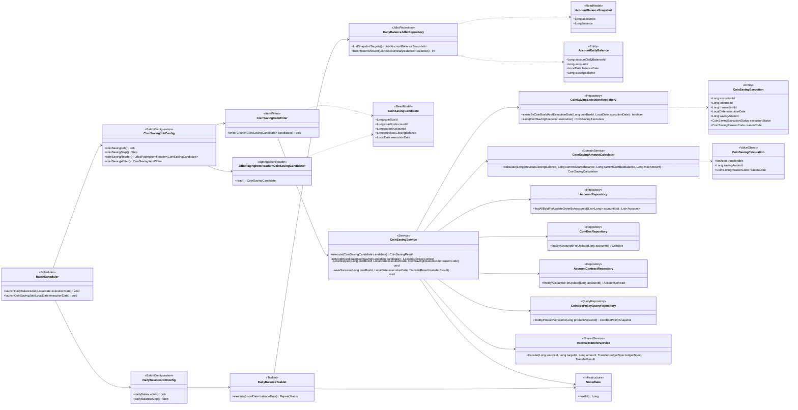

# CoinBox Class Diagram

이 문서는 ERD와 시퀀스 다이어그램을 구현하기 위한 목표 클래스 구조를 정의한다.
현재 소스 코드의 구현 완료 여부가 아니라 확정된 업무 설계를 기준으로 작성한다.

---

## 1. 설계 원칙

- 온라인 요청과 배치 처리를 분리하여 다이어그램의 책임을 명확하게 표현한다.
- `Controller → Service → Repository` 구조를 사용한다.
- 엔티티 사이의 FK는 객체 연관관계가 아니라 Snowflake `Long` ID로 관리한다.
- 다이어그램의 엔티티 간 점선은 논리적 참조를 의미하며 JPA 연관관계 매핑을 의미하지 않는다.
- 단순 저장과 일반 조회는 Spring Data JPA Repository를 사용한다.
- 복잡한 조인 조회와 대량 데이터 처리는 전용 Query Repository 또는 `JdbcTemplate`을 사용한다.
- 금융거래 생성과 두 계좌 잔액 변경은 `InternalTransferService`에 집중한다.
- 요청·응답 DTO의 세부 필드는 API 설계 단계에서 확정하며, 본 문서에서는 업무 흐름에 필요한 타입만 표시한다.
- Enum의 저장값과 한글 설명은 [`ERD.md`](./ERD.md)를 기준으로 한다.
- HTTP 요청·응답과 공통 예외 처리는 [`API.md`](./API.md)에서 별도로 정의한다.

---

## 2. 온라인 프로세스 클래스 다이어그램

신규가입, 비우기와 해지는 `CoinBoxService`가 저금통 고유 규칙을 조정하고,
실제 계좌 간 자금 이동은 `InternalTransferService`에 위임한다.

```mermaid
classDiagram
    direction LR

    class CoinBoxController {
        <<Controller>>
        +findEligibleAccounts(Long customerId) List~EligibleAccountResponse~
        +openCoinBox(Long customerId, OpenCoinBoxRequest request) CoinBoxResponse
        +emptyCoinBox(Long customerId, String accountNumber) TransferResponse
        +terminateCoinBox(Long customerId, String accountNumber) CoinBoxResponse
    }

    class CoinBoxService {
        <<Service>>
        +findEligibleAccounts(Long customerId) List~Account~
        +openCoinBox(Long customerId, Long selectedAccountId, LocalDate openDate) CoinBox
        +emptyCoinBox(Long customerId, String accountNumber) TransferResult
        +terminateCoinBox(Long customerId, String accountNumber, LocalDate terminationDate) void
        -validateEligibleAccount(Account account) void
        -validateTerminationState(Account account, AccountContract contract) void
    }

    class InternalTransferService {
        <<Service>>
        +transfer(Long sourceId, Long targetId, Long amount, TransferLedgerSpec ledgerSpec) TransferResult
        +transferAll(Long sourceId, Long targetId, TransferLedgerSpec ledgerSpec) TransferResult
        -lockAccountsInAscendingOrder(Long firstId, Long secondId) List~Account~
        -validateTransferable(Account source, Account target) void
        -createTransactionAndEntries(Account source, Account target, Long amount, TransferLedgerSpec ledgerSpec) TransferResult
    }

    class TransferLedgerSpec {
        <<ValueObject>>
        +EntryCode sourceEntryCode
        +String sourceDescription
        +EntryCode targetEntryCode
        +String targetDescription
    }

    class TransferResult {
        <<ValueObject>>
        +Long transactionId
        +Long amount
        +Long sourceBalanceAfter
        +Long targetBalanceAfter
    }

    class CustomerRepository {
        <<Repository>>
        +findByIdForUpdate(Long customerId) Customer
    }

    class AccountRepository {
        <<Repository>>
        +findEligibleDemandDepositAccounts(Long customerId) List~Account~
        +findByCustomerIdAndAccountNumber(Long customerId, String accountNumber) Account
        +findAllByIdForUpdateOrderByAccountId(List~Long~ accountIds) List~Account~
        +existsNonClosedCoinBox(Long customerId) boolean
        +save(Account account) Account
    }

    class AccountContractRepository {
        <<Repository>>
        +findByAccountIdForUpdate(Long accountId) AccountContract
        +save(AccountContract contract) AccountContract
    }

    class CoinBoxRepository {
        <<Repository>>
        +findByAccountIdForUpdate(Long accountId) CoinBox
        +save(CoinBox coinBox) CoinBox
    }

    class CoinBoxPolicyQueryRepository {
        <<QueryRepository>>
        +findEffectivePolicy(LocalDate date) CoinBoxPolicySnapshot
        +findByProductVersionId(Long productVersionId) CoinBoxPolicySnapshot
    }

    class FinancialTransactionRepository {
        <<Repository>>
        +save(FinancialTransaction transaction) FinancialTransaction
    }

    class AccountEntryRepository {
        <<Repository>>
        +saveAll(List~AccountEntry~ entries) List~AccountEntry~
    }

    class Snowflake {
        <<Infrastructure>>
        +nextId() Long
    }

    class Customer {
        <<Entity>>
        +Long customerId
        +CustomerStatus customerStatus
    }

    class Account {
        <<Entity>>
        +Long accountId
        +Long customerId
        +ProductType productType
        +Long parentAccountId
        +Long balance
        +AccountStatus accountStatus
        +debit(Long amount) void
        +credit(Long amount) void
        +close() void
    }

    class AccountContract {
        <<Entity>>
        +Long accountContractId
        +Long accountId
        +Long productVersionId
        +ContractStatus contractStatus
        +LocalDate contractEndDate
        +terminate(LocalDate terminationDate) void
    }

    class CoinBox {
        <<Entity>>
        +Long coinBoxId
        +Long accountId
        +boolean coinSavingEnabled
        +LocalDate coinSavingStartDate
        +disableCoinSaving() void
    }

    class CoinBoxPolicySnapshot {
        <<ReadModel>>
        +Long productVersionId
        +Long coinBoxPolicyId
        +Long maxAmount
    }

    class FinancialTransaction {
        <<Entity>>
        +Long transactionId
        +TransactionType transactionType
        +Long transactionAmount
        +TransactionStatus transactionStatus
        +LocalDateTime executionDatetime
    }

    class AccountEntry {
        <<Entity>>
        +Long entryId
        +Long accountId
        +Long transactionId
        +EntryType entryType
        +EntryCode entryCode
        +Long amount
        +Long balanceBefore
        +Long balanceAfter
    }

    CoinBoxController --> CoinBoxService
    CoinBoxService --> InternalTransferService : 비우기·해지
    CoinBoxService --> CustomerRepository
    CoinBoxService --> AccountRepository
    CoinBoxService --> AccountContractRepository
    CoinBoxService --> CoinBoxRepository
    CoinBoxService --> CoinBoxPolicyQueryRepository
    CoinBoxService --> Snowflake

    InternalTransferService --> AccountRepository
    InternalTransferService --> FinancialTransactionRepository
    InternalTransferService --> AccountEntryRepository
    InternalTransferService --> Snowflake
    InternalTransferService ..> TransferLedgerSpec
    InternalTransferService ..> TransferResult

    CustomerRepository ..> Customer
    AccountRepository ..> Account
    AccountContractRepository ..> AccountContract
    CoinBoxRepository ..> CoinBox
    CoinBoxPolicyQueryRepository ..> CoinBoxPolicySnapshot
    FinancialTransactionRepository ..> FinancialTransaction
    AccountEntryRepository ..> AccountEntry

    Account ..> Account : parentAccountId
    AccountContract ..> Account : accountId
    CoinBox ..> Account : accountId
    AccountEntry ..> Account : accountId
    AccountEntry ..> FinancialTransaction : transactionId
```

### 2.1 온라인 클래스 책임

| 클래스 | 핵심 책임 | 관련 프로세스 |
|---|---|---|
| `CoinBoxController` | 요청값 수신, DTO 변환과 결과 응답. 업무 판단은 수행하지 않는다. | 가입, 비우기, 해지 |
| `CoinBoxService` | 저금통 고유 가입 조건, 고객당 1개 제약, 상품 정책 선택, 연결 관계와 해지 상태를 검증하고 전체 흐름을 조정한다. | `JOIN-*`, `EMPTY-01~02`, `TERM-*` |
| `InternalTransferService` | 계좌 ID 오름차순 잠금, 계좌 상태와 잔액 검증, 금융거래·원장·잔액의 원자적 반영을 담당한다. | `EMPTY-03~05`, `TERM-04`, `CS-06` |
| `TransferLedgerSpec` | 동일한 이체 로직에서 비우기·해지·동전모으기의 원장 코드와 통장 적요를 다르게 전달한다. | 비우기, 해지, 동전모으기 |
| `CustomerRepository` | 고객 잠금으로 동일 고객의 가입·해지 경쟁을 직렬화한다. | `JOIN-03`, `TERM-01` |
| `AccountRepository` | 가입 가능 계좌 조회, 고객 소유 계좌 조회와 계좌 ID 오름차순 잠금 조회를 담당한다. | 모든 온라인 프로세스 |
| `CoinBoxPolicyQueryRepository` | `PRODUCT`, `PRODUCT_VERSION`, `COINBOX_POLICY` 조인을 한 읽기 모델로 반환하여 Service의 조인 세부사항을 숨긴다. | `JOIN-04`, `CS-04` |
| `AccountContractRepository` | 계약 생성 및 해지 시 활성 계약 잠금·종료를 담당한다. | `JOIN-05`, `TERM-02·05` |
| `CoinBoxRepository` | 저금통 설정 생성 및 동전모으기 설정 잠금·종료를 담당한다. | `JOIN-05`, `TERM-02·05` |
| `FinancialTransactionRepository` | 하나의 자금 이동을 나타내는 금융거래 헤더를 저장한다. | 비우기, 해지, 동전모으기 |
| `AccountEntryRepository` | 출금·입금 계좌별 원장 두 건을 저장한다. | 비우기, 해지, 동전모으기 |

### 2.2 온라인 트랜잭션 경계

| Service 메서드 | 트랜잭션 범위 |
|---|---|
| `CoinBoxService.openCoinBox` | 고객·선택 계좌 잠금부터 `ACCOUNT`, `ACCOUNT_CONTRACT`, `COINBOX` 생성까지 |
| `CoinBoxService.emptyCoinBox` | 저금통 검증부터 `InternalTransferService.transferAll`의 거래·원장·잔액 반영까지 |
| `CoinBoxService.terminateCoinBox` | 고객·계좌·설정·계약 잠금, 필요 시 잔액 이전, 계좌·계약·설정 종료까지 |
| `InternalTransferService` | 호출한 온라인 트랜잭션에 참여하며, 단독 이체 호출 시에도 동일한 원자성 경계를 제공한다. |

---

## 3. 배치 프로세스 클래스 다이어그램

일별 잔액은 Tasklet 한 단계로 처리하고, 동전모으기는 잠금 없는 페이징 Reader와
후보별 업무 트랜잭션을 수행하는 Writer·Service로 분리한다.

### 3.1 배치 클래스 책임

| 클래스 | 핵심 책임 | 관련 단계 |
|---|---|---|
| `BatchScheduler` | 실행 일정에 맞춰 날짜 파라미터와 함께 각 Job을 시작한다. | `BAL-01`, `CS-01` |
| `DailyBalanceJobConfig` | 일별 잔액 Job과 단일 Tasklet Step을 구성한다. | `BAL-*` |
| `DailyBalanceTasklet` | 기준일 계산 결과를 받아 대상 조회, Snowflake ID 생성과 일괄 저장을 조정한다. | `BAL-02~05` |
| `DailyBalanceJdbcRepository` | `ACTIVE`, `RESTRICTED` 계좌의 일관된 잔액 조회와 복합 UK 기반 멱등 일괄 저장을 수행한다. | `BAL-02`, `BAL-04` |
| `CoinSavingJobConfig` | `JdbcPagingItemReader`와 `CoinSavingItemWriter`로 Chunk Step을 구성하며 기본 페이지는 1,000건, 청크는 1건으로 설정한다. | `CS-01~02` |
| `JdbcPagingItemReader<CoinSavingCandidate>` | `coinbox_id` 오름차순으로 잠금 없는 후보 조회를 수행하고 전일 잔액을 후보에 포함한다. | `CS-02` |
| `CoinSavingItemWriter` | 후보를 순회하며 저금통별 업무 서비스를 호출한다. 업무 조회나 금액 계산은 수행하지 않는다. | `CS-03~08` |
| `CoinSavingService` | 잠금, 상태·계약·정책·실행 이력 재검증과 성공·건너뜀 실행 이력 저장을 조정한다. | `CS-03~08` |
| `CoinSavingAmountCalculator` | DB 접근 없이 전일 잔돈, 실행 시점 잔액과 한도로 실제 저축액 또는 건너뜀 사유를 계산한다. | `CS-05` |
| `CoinSavingExecutionRepository` | 실행 이력 재확인과 `SUCCESS`, `SKIPPED` 결과 저장을 담당한다. | `CS-04`, `CS-06~07` |
| `InternalTransferService` | 온라인 프로세스와 같은 계좌 잠금·거래·원장·잔액 처리 규칙을 재사용한다. | `CS-06` |

### 3.2 배치 트랜잭션 경계

| 처리 | 트랜잭션 범위 |
|---|---|
| 일별 최종 잔액 | Tasklet의 대상 조회부터 `ACCOUNT_DAILY_BALANCE` 일괄 저장까지 하나의 Step 트랜잭션 |
| 동전모으기 후보 조회 | 비관적 잠금이 없는 페이징 조회. 후보를 확정하는 트랜잭션이 아니다. |
| 동전모으기 후보 1건 | 청크 크기 1을 기준으로 계좌·설정·계약 잠금부터 `SUCCESS` 또는 `SKIPPED` 실행 이력 저장까지 독립 트랜잭션 |
| 동전모으기 시스템 오류 | 해당 후보의 업무 변경 전체 Rollback. 상세 재시도·Batch 메타데이터 설계는 현재 범위에서 제외 |

---

## 4. Persistence 책임

| 클래스 | 주요 조회 테이블 | 주요 변경 테이블 |
|---|---|---|
| `CoinBoxService` | `CUSTOMER`, `ACCOUNT`, `PRODUCT`, `PRODUCT_VERSION`, `COINBOX_POLICY`, `COINBOX`, `ACCOUNT_CONTRACT` | 가입 시 `ACCOUNT`, `ACCOUNT_CONTRACT`, `COINBOX`; 해지 시 세 테이블의 상태 |
| `InternalTransferService` | 잠금 대상 `ACCOUNT` | `ACCOUNT`, `FINANCIAL_TRANSACTION`, `ACCOUNT_ENTRY` |
| `DailyBalanceJdbcRepository` | `ACCOUNT` | `ACCOUNT_DAILY_BALANCE` |
| `JdbcPagingItemReader<CoinSavingCandidate>` | `COINBOX`, 저금통·연결 `ACCOUNT`, `ACCOUNT_DAILY_BALANCE`, `COIN_SAVING_EXECUTION` | 없음 |
| `CoinSavingService` | 잠금 대상 `ACCOUNT`, `COINBOX`, `ACCOUNT_CONTRACT`; 조회 전용 `PRODUCT_VERSION`, `COINBOX_POLICY`; 실행 이력 | `COIN_SAVING_EXECUTION` 및 `InternalTransferService`가 변경하는 거래·원장·계좌 |

---

## 5. 프로세스 추적표

| 프로세스 단계 | 진입 클래스 | 핵심 처리 클래스 | 데이터 결과 |
|---|---|---|---|
| `JOIN-01~02` | `CoinBoxController` | `CoinBoxService`, `AccountRepository` | 조회 결과만 반환 |
| `JOIN-03~06` | `CoinBoxController` | `CoinBoxService` | `ACCOUNT`, `ACCOUNT_CONTRACT`, `COINBOX` 생성 |
| `EMPTY-01~02` | `CoinBoxController` | `CoinBoxService` | 저금통 검증 및 이체 명령 구성 |
| `EMPTY-03~05` | `CoinBoxService` | `InternalTransferService` | 금융거래·원장 생성 및 두 계좌 잔액 변경 |
| `TERM-01~03` | `CoinBoxController` | `CoinBoxService` | 해지 대상 잠금·검증 및 잔액 분기 |
| `TERM-04~06` | `CoinBoxService` | `InternalTransferService`, `CoinBoxService` | 필요 시 잔액 이전 후 계좌·계약·설정 종료 |
| `BAL-01~05` | `BatchScheduler` | `DailyBalanceTasklet`, `DailyBalanceJdbcRepository` | `ACCOUNT_DAILY_BALANCE` 생성 |
| `CS-01~02` | `BatchScheduler` | `CoinSavingJobConfig`, `JdbcPagingItemReader` | 잠금 없는 후보 스트림 |
| `CS-03~08` | `CoinSavingItemWriter` | `CoinSavingService`, `CoinSavingAmountCalculator`, `InternalTransferService` | 성공 거래·원장·실행 이력 또는 건너뜀 실행 이력 |

---

## 6. 구현 시 주의사항

- Repository가 반환한 엔티티 사이에 `@ManyToOne`, `@OneToMany` 등을 추가하지 않고 FK는 `Long`으로 유지한다.
- 잠금 조회 메서드는 다이어그램에 표시된 순서를 보장해야 하며, 여러 계좌는 SQL의 `order by account_id`와
  비관적 쓰기 잠금을 함께 사용한다.
- `InternalTransferService`의 출금·입금 원장 생성은 한쪽만 성공할 수 없도록 같은 트랜잭션에서 수행한다.
- `CoinSavingAmountCalculator`는 Repository에 의존하지 않는 순수 계산 클래스로 두어 한도 경계값과
  `SKIPPED` 사유를 단위 테스트하기 쉽게 만든다.
- `CoinBoxPolicyQueryRepository`는 상품 관련 세 테이블의 조인 결과를 읽기 모델로 반환하되,
  계약에는 조회 결과 전체가 아니라 `product_version_id`만 저장한다.
- `ACCOUNT_DAILY_BALANCE`와 `COIN_SAVING_EXECUTION`의 복합 UK를 애플리케이션 사전 조회만으로
  대체하지 않고 DB의 최종 정합성 제약으로 유지한다.
